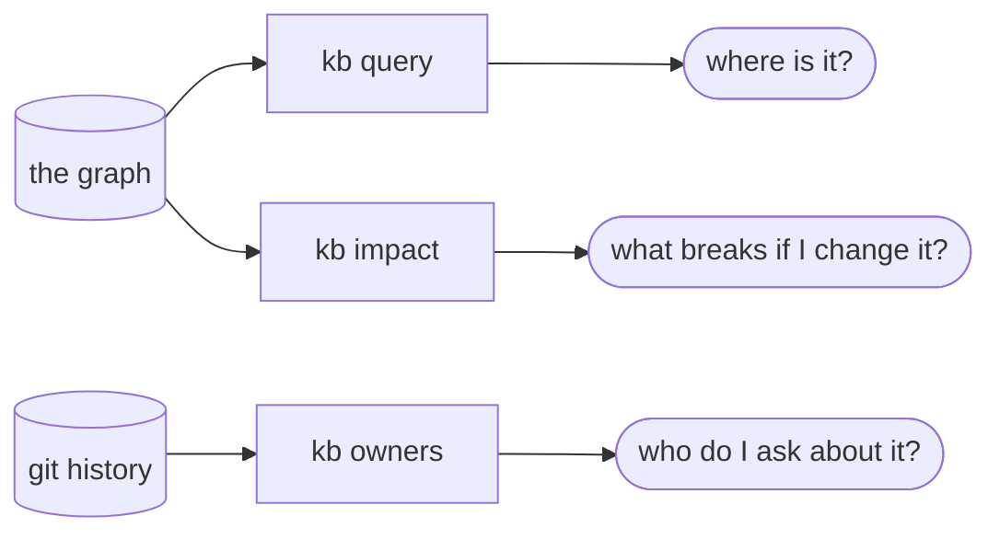

# Ask the graph

Three commands answer the questions the graph exists for: `kb query` finds a symbol, `kb impact`
finds what breaks if you change it, and `kb owners` finds who to ask about it. All three print a
citation you can open, all three take `--json`, and none of them needs an editor or an MCP client.

The same three answers reach an agent over MCP as `search_code` / `semantic_search` /
`hybrid_search`, `blast_radius`, and `who_knows`; see
[Serve it to your editor](serving-over-mcp.md). This page is the terminal-side equivalent.



<div class="dg-key">
  <i><b class="dg-sh-store"></b>a cylinder is something that persists</i>
  <i><b class="dg-sh-step"></b>a rectangle is something that runs</i>
  <i><b class="dg-sh-act"></b>a rounded box is a start or an end point</i>
</div>

The split on the left is the one worth noticing: `query` and `impact` read the store, `owners` reads
git history, which is why it answers in a directory that was never indexed. Give it a repo id rather
than a path and it does open the store, only to find the clone.

## Prerequisites

- A store with an indexed repo in it: [Index the code graph](indexing-the-code-graph.md), or
  `contextlake bootstrap`. `kb owners` is the exception, it reads git directly and needs neither.
- For `--retriever semantic` or `hybrid`, a `contextlake kb embed` run as well:
  [Semantic search](searching-semantically.md).

> [!IMPORTANT]
> Query an empty store and you get `No matches`, exit `0`, which looks exactly like a genuine miss.
> Opening the store creates it if it is absent (`SqliteStore.__init__` in
> `src/contextlake/kb/store/sqlite_store.py` runs `mkdir(parents=True, exist_ok=True)` and applies a
> `CREATE TABLE IF NOT EXISTS` schema), so nothing tells you the index was never built. Run
> `contextlake doctor` if the counts look wrong; it reports the store's real node and edge totals.

## Find something: `kb query`

```bash
contextlake kb query "CatalogService"
contextlake kb query charge --kind function --repo acme/billing-service
contextlake kb query "how do we charge a card" --retriever semantic
contextlake kb query charge --repo acme/billing-service --as-of a1b2c3
```

Each hit prints as `repo · file:line · kind · name`, so every result is a place you can open.

| Flag | What it does | Default |
| --- | --- | --- |
| `--kind KIND` | Only nodes of this kind (`function`, `class`, `table`, …) | all kinds |
| `--repo REPO` | Only this repository | all repos |
| `--limit N` | Most results to print | `20` |
| `--retriever fts\|semantic\|hybrid` | Which retrieval mode to use | `fts` |
| `--as-of COMMIT` | Search a repo's snapshot at a previously-indexed commit (needs `--repo`) | latest |
| `--json` | A JSON array on stdout; every log line moves to stderr | off |

### The three retrieval modes, and which to reach for

| Mode | How it matches | Good for | Bad at |
| --- | --- | --- | --- |
| `fts` (default) | SQLite FTS5 over node name, qualified name and file, as **prefix** terms | a name you know, or its first few characters | a description of what the code does |
| `semantic` | nearest neighbours in embedding space | "how do we charge a card", where you have the idea and not the name | an exact rare identifier |
| `hybrid` | semantic seeds, then a Personalized PageRank rerank over the graph | most real questions | nothing in particular, it is the slowest of the three |

**`fts` is prefix search, not substring search.** Each word you type becomes a quoted prefix term,
so `Catalog` finds `CatalogService` and `Service` does not
(`_fts_query` in `src/contextlake/kb/store/sqlite_store.py`). Multiple words are an implicit AND of
prefix terms. That is the single most common reason a query that "should" match comes back empty.

**Semantic and hybrid degrade to `fts` rather than failing**, and say so on stderr, when there is no
embedder configured or the vector store cannot be opened
(`src/contextlake/kb/cmds/query.py`, the `_semantic_results` fallbacks). One gap is worth knowing:
if the vector store opens but is *empty*, the retriever returns no results rather than being
unavailable, so there is no fallback and no warning. An unexpectedly empty
`--retriever semantic` run usually means `contextlake kb embed` has not run yet.

**`--kind` is applied differently per mode.** On `fts` it is part of the SQL, so `--limit 20` gives
you up to 20 matching nodes. On `semantic` and `hybrid` it is a filter applied *after* the retriever
has already cut to `--limit`, so `--retriever semantic --kind function --limit 20` can return far
fewer than 20 functions even when the repo has hundreds.

**`--as-of` is a different search, not the same search over old data.** It reads the repo's stored
shard for that commit and matches with a case-insensitive substring test, so it neither uses FTS nor
honours `--retriever`. It needs `--repo`, because history is kept per repository.

### Verification

```bash
contextlake kb query CatalogService --limit 3
```

You should get up to three lines shaped like
`acme/catalog-api · src/catalog/service.py:41 · class · CatalogService`. If you get
`No matches for 'CatalogService'`, check the index is populated with `contextlake doctor` before
suspecting the query.

## See what breaks: `kb impact`

```bash
contextlake kb impact charge
contextlake kb impact charge --repo acme/billing-service --hops 2
contextlake kb blast-radius charge --json          # the same command
```

<p align="center">
  
</p>

| Flag | What it does | Default |
| --- | --- | --- |
| `--repo REPO` | Disambiguate a symbol defined in more than one repo | none |
| `--hops N` | How many reverse hops to walk | `3` |
| `--limit N` | Most affected nodes to list | `100` |
| `--json` | A JSON object on stdout | off |

`impact` walks the graph **backwards**. It follows edges *into* the node you named, so it answers
"what depends on this", not "what does this depend on".

**Seven relations** are traversed by default: `calls`, `depends_on`, `inherits`, `references`,
`reads`, `writes` and `uses`. See `DEFAULT_RELATIONS` in `src/contextlake/kb/impact.py`.

There is no CLI flag to change that set. The MCP `blast_radius` tool takes a `relations` argument
if you need a different walk.

`transitions_to` is deliberately left out of the default set. See
[Entity state machines](code-graph-model.md#entity-state-machines).

Each affected node is reported once, at the first hop that reached it, with the relation it came
through and that edge's confidence. Incoming edges are visited **highest-confidence first**
(`EXTRACTED`, then `INFERRED`, then `AMBIGUOUS`), which is what makes a truncated result still worth
reading: when `--limit` is reached the whole walk stops, so what you get is a bounded slice of the
most trustworthy edges rather than an arbitrary prefix. The output says `(truncated)` when that
happened. There is no pagination; raise `--limit` instead.

**Ambiguity is reported, not guessed at.** This holds at two levels.

Within one repository, a name matching several definitions no longer silently takes the first. The
seed is named with its `file:line` and how many definitions competed for it, the first five
alternatives that were passed over are listed with their node ids (with a count of any beyond that),
every hit cites the call site the edge was read from,
and a footer counts how much of the answer rests on name-only matching:

```text
Impact of changing close (contextlake_site_cmdk_js_close_113): 1 affected node(s) within 1 hop(s)
  seed: function site/cmdk.js:113 (3 matched 'close'; used the first)
        or: method src/contextlake/kb/store/base.py:27  --node contextlake_src_contextlake_kb_store_base_py_store_close_27
        or: method src/contextlake/kb/store/sqlite_store.py:179  --node contextlake_src_contextlake_kb_store_sqlite_store_py_sqlitestore_close_179
  h1  contextlake:site/cmdk.js  (file, site/cmdk.js)  via calls at site/cmdk.js:121  [ambiguous, 1 of 3 same-name definitions]
  1 of 1 hit(s) came from a reference matched by NAME across several same-named definitions; each caller may target a different one. Open the cited call site to confirm.
```

**To ask about one of the alternatives instead, pass its node id as the argument**, not as a flag:

```bash
contextlake kb impact contextlake_src_contextlake_kb_store_base_py_store_close_27
```

`impact` tries an exact node id before it tries anything else, so an id resolves to that one
definition and nothing else. (The `--node ` prefix those lines are printed with is `kb graph`'s
flag name; `kb impact` has no `--node` flag and will tell you so if you pass one.)

The footer is the part worth reading twice. `AMBIGUOUS` as a label read exactly the same on a
hand-verified answer where all eleven hits were real and on one carrying 282 false positives, so
the count is there to say what the label costs *in this result*: `3 of 3` means treat the whole
list as leads, `1 of 40` means the opposite.

A symbol defined in several **repos** makes `impact` say so,
name how many repos define it, list the candidates, and exit `1`, so you can narrow it yourself:

```text
  --repo acme/billing-service   (function charge)
  --repo acme/catalog-api       (method charge)
```

The candidate list stops at 10 repos even when the count in the line above it is higher.

> [!WARNING]
> A name that matches no node exactly falls back to a fuzzy search and takes the top hit, silently
> (`resolve_target` in `src/contextlake/kb/impact.py`). A typo can therefore produce a confident
> blast radius for the wrong symbol. The header line always names the node that was actually
> resolved, `Impact of changing <name> (<node id>)`, so read it before trusting the list.

### Verification

```bash
contextlake kb impact <a symbol you know has callers> --hops 1
```

You should see `... : N affected node(s) within 1 hop(s)` followed by `h1` lines. A symbol with no
dependents prints `nothing depends on it within 1 hop(s)` and exits `0`; that is a real answer, not
a failure.

## Find who to ask: `kb owners`

```bash
contextlake kb owners acme/payments-api                  # the whole repo
contextlake kb owners acme/payments-api --path src/auth  # one sub-tree
contextlake kb owners .                                  # a directory on disk, no index needed
contextlake kb who-knows acme/payments-api --json        # the same command
```

<p align="center">
  
</p>

| Flag | What it does | Default |
| --- | --- | --- |
| `--path SUBDIR` | Rank contributors to this sub-tree only | the whole repo |
| `--limit N` | Most owners to list | `10` |
| `--json` | A JSON object on stdout | off |

Give it a **path that exists on disk** and it never opens the store at all, so
`contextlake kb owners .` works on a machine that has never indexed anything. Give it a **repo id**
and it looks that id up in the store to find the clone; an id it does not know exits `1` and
suggests close matches.

### How the ranking works

Each contributor's score is

```text
sum over their commits of (lines_changed + 1) * 0.5 ** (age_days / 180)
```

(`src/contextlake/kb/ownership.py`, `HALFLIFE_DAYS = 180.0`). Three consequences worth knowing:

- **Volume and recency both count.** The `+ 1` means a commit scores even when it changed no
  countable lines, so a prolific reviewer of small changes still ranks.
- **Age is measured from the newest commit in the history examined, not from today.** An archived
  repo therefore still returns a sensible ranking of who was active *within that repo's own
  timeline*, and the answer does not drift as time passes.
- **`--path` moves that baseline too**, because the newest commit is recomputed over only the
  commits touching that path.

The printed percentage is each contributor's share of the total score, not a share of commits.
Contributors are aggregated by email where there is one, and shown under the name on their most
recent commit.

> [!NOTE]
> `owners` runs exactly one `git log --no-merges --numstat` and cannot tell you *why* it came back
> empty: no history, a path that matches nothing, `git` missing from PATH and the 30-second timeout
> all print `No commit history found for <scope>` and exit `0`.

### Verification

```bash
contextlake kb owners . --limit 3
```

In any git repository with history you should get `Owners / SMEs for <dir> (recency-weighted):`
followed by up to three numbered lines ending in a percentage.

## Scripting these commands

`--json` on any of the three prints the result on stdout and moves every human line to stderr, so
`contextlake kb query foo --json | jq` is safe. The shapes differ per command:

| Command | Top-level JSON | Notes |
| --- | --- | --- |
| `kb query` | an **array** of hits | keys `repo`, `file`, `line`, `kind`, `name`, `qualified_name`. No score field |
| `kb impact` | an **object** | `target` (with `file`/`line`), `hops`, `truncated`, `ambiguous`, `other_definitions[]`, `affected[]`; each hit carries `id`, `file`, `line`, `via_file`, `via_line`, `name_candidates`. `confidence` is lower-case |
| `kb owners` | an **object** | `repo`, `path`, `owners[]`; email and raw score are not included |

Three behaviours that bite scripts:

- **An empty result is exit `0`**, in all three. Test the payload, not the exit code, to detect
  "found nothing". Exit `2` means you gave no search term; exit `1` means the target could not be
  resolved.
- **`--limit 0` and `--hops 0` are refused**, with the argument error and exit `2`: `--limit` takes
  1 to 1,000,000 and `--hops` takes 1 to 1,000. Zero used to be read as "unset" and quietly became
  the default, which is exactly why it is now an error. Neither ever meant "no limit".
- **The `--as-of` argument check is the one error that ignores `--json`**: `--as-of` without
  `--repo` prints a plain line to stderr and exits `2` with no JSON error object.

## The graph, on this page


<p class="shot-cap">Every answer on this page comes out of the same graph you are looking at. Search a symbol, then follow its edges. It is the shipped visualizer, not a recording, and it runs
offline with no network calls.</p>

## See also

- [Serve it to your editor](serving-over-mcp.md), the same answers as MCP tools
- [Index the code graph](indexing-the-code-graph.md), what the graph contains to be asked about
- [Semantic search](searching-semantically.md), what `--retriever semantic` needs first
- [The dashboard](using-the-dashboard.md), the same queries in a browser
- [Reading the console output](console-output.md), decoding a run
