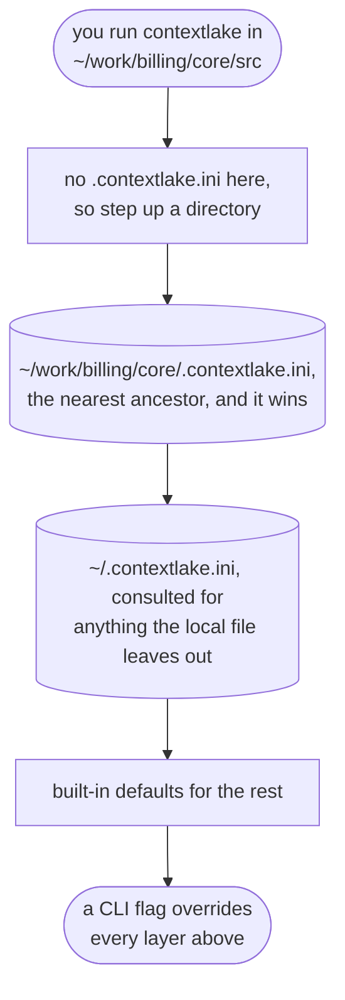

# Configuration

contextlake reads persistent settings from a config file, with CLI arguments overriding them. (Installing
contextlake is covered in the [Quickstart](../QUICKSTART.md); the knowledge-layer extras are in the
[Knowledge layer](knowledge-layer.md) overview.)

Finding the file is a walk up the directory tree, not a lookup in one fixed place. A worked example,
run three directories below the config that ends up applying:



<div class="dg-key">
  <i><b class="dg-sh-step"></b>a rectangle is something that runs</i>
  <i><b class="dg-sh-store"></b>a cylinder is something that persists</i>
  <i><b class="dg-sh-act"></b>a rounded box is a start or an end point</i>
</div>

The walk stops at the filesystem root, and the *nearest* ancestor wins if projects are nested.

## Using configuration files

Configuration is loaded in this precedence order:

1. **Local config**: the nearest ancestor directory's `.contextlake.ini`, walking up from the current
   directory to the filesystem root (like git's `.git` discovery), highest priority. A config at your
   project root is inherited by every subdirectory underneath it; you don't need to be in the exact
   directory that holds the file.
2. **Global config**: `~/.contextlake.ini` in the home directory
3. **Default values**: built-in defaults (lowest priority)
4. **CLI arguments**: override all other settings

Run `contextlake init --local` inside a project to create that project's local config
(`.contextlake.ini` + `.contextlake/kb.toml`'s knowledge-layer equivalent, `.contextlake.kb.toml`) instead
of the global one, see [Directory-scoped config](#directory-scoped-config) below.

An example `.contextlake.ini`:

```ini
[contextlake]
work_dir = ~/work
gitlab_group = your-gitlab-group
clone_timeout = 300
fetch_timeout = 60
branch_timeout = 30
pull_timeout = 60
max_workers = 8
```

## Overriding on the command line

Any setting can be overridden per-invocation. The config file is the recommended home for persistent
values; use flags for one-off overrides:

```bash
contextlake --work-dir /path/to/workspace mirror sync   # override work_dir
contextlake --group my-gitlab-group mirror sync          # override the group
contextlake --config /path/to/custom.ini mirror sync     # use a different config file
contextlake --work-dir /home/user/dev --group your-gitlab-group mirror status  # combine
```

## Directory-scoped config

A single global config (`~/.contextlake.ini` + `~/.contextlake/kb.toml`) works well when you only ever
mirror one org into one workspace. If you work across several orgs or projects, each with its own
platform, group, or knowledge-layer sources, scope a config to a project instead:

```bash
cd ~/work/some-project
contextlake init --local        # writes .contextlake.ini + .contextlake.kb.toml here
contextlake kb source add jira --type atlassian --local   # scopes a source the same way
```

Every command run from that directory (or any subdirectory underneath it) picks up this local config
automatically, you don't need to pass `--config` yourself, and you don't need to be in the exact
directory the file lives in. Resolution walks up from the current directory to the filesystem root
looking for `.contextlake.ini` / `.contextlake.kb.toml`, the same way `git` finds `.git` from anywhere
inside a repo; the *nearest* ancestor wins if more than one project happens to be nested.

`--local` on `source add`/`remove`/`enable`/`disable` targets that same nearest-ancestor file (creating
one in the current directory if none exists yet in the chain); once a project has a local config, those
commands land in it by default without needing `--local` again. An explicit `--config PATH` always takes
precedence over both the local and global tiers.

`init --local` also scopes one of the *values* it writes, not just the config file's location: the
knowledge-layer's `store_dir` defaults to a `.contextlake/kb` directory next to the workspace instead
of the global `~/.contextlake/kb` (override with `--store-dir`), so two separate `--local` projects
never end up sharing one store. `work_dir` is not part of that: **every** `contextlake init` defaults
it to the current directory, `--local` or not (override interactively, or with `--work-dir`).

## Workspace trust

Because a local config is *discovered* rather than named, one can take effect that you never wrote:
notably a `.contextlake.kb.toml` that came inside a repository you cloned. So the few config keys that
become part of a command contextlake executes are honoured **only** from the global
`~/.contextlake/kb.toml` or from a path you pass to `--config`:

| Key | Reaches |
| --- | --- |
| `[llm] command`, `[llm] args` | the agent CLI run when `provider = "cli"` |
| `[llm] provider`, `[llm] review_provider` | only when set to `"cli"` |
| `[[sources]] command`, `args`, `mcp_command` | the MCP server spawned over stdio |

In a discovered `.contextlake.kb.toml` those keys are ignored, with a warning naming the file and the
key. Nothing else changes: `store_dir`, `languages`, `max_file_bytes`, `[embeddings]`, `[[rules]]`, and
any non-`cli` LLM provider all keep working from a local file exactly as before. The one thing to know
when scoping sources with `contextlake kb source add ... --local` is that an *MCP* source's `command`
has to live in the global file (or be reached with `--config`); an `mcp` **URL** is fine locally.

Set `CONTEXTLAKE_NO_LOCAL_CONFIG=1` to skip ancestor discovery entirely, for both `.contextlake.ini` and
`.contextlake.kb.toml`, recommended in CI, containers, and anywhere untrusted checkouts are processed in
bulk. With it set, `source add --local` writes to the global config too, rather than to a local file that
would never be read. See [SECURITY.md](../SECURITY.md#workspace-trust) for the full model.

## Settings reference

| Setting | Description | Default | Example |
| --- | --- | --- | --- |
| `work_dir` | Working directory for repositories | `~/work` | `/home/user/projects` |
| `platform` | Platform to mirror: `gitlab`, `github`, `bitbucket`, `gitea` (+ `codeberg`/`forgejo` flavors) | `gitlab` | `github` |
| `group` | The group / org / workspace / owner to mirror (`gitlab_group` is its alias) | none | `your-org` |
| `gitlab_group` | GitLab group to synchronize | `your-gitlab-group` | `mycompany-group` |
| `token_env` | Env var holding the platform token | per platform (`GITHUB_TOKEN`, and so on) | `MY_TOKEN` |
| `api_base` | REST endpoint for self-hosted / enterprise instances | per platform | `https://github.example.com/api/v3` |
| `cache_dir` | Directory for cache files. Unset, the cache goes to a per-workspace subdirectory of `~/.cache/contextlake` (`$XDG_CACHE_HOME/contextlake` when set), created `0700`. Set it and that exact directory is used, with no subdirectory. | `~/.cache/contextlake/<workspace>-<id>` | `/srv/cache` |
| `cache_file` | Name of projects cache file | `gitlab_projects.txt` | `projects.txt` |
| `cache_json` | Name of JSON cache file | `gitlab_projects.json` | `projects.json` |
| `clone_timeout` | Clone operation timeout (seconds) | `300` | `600` |
| `fetch_timeout` | Fetch operation timeout (seconds) | `60` | `120` |
| `branch_timeout` | Branch operation timeout (seconds) | `30` | `60` |
| `pull_timeout` | Pull operation timeout (seconds) | `60` | `120` |
| `max_workers` | Maximum parallel workers | `8` | `4` |
| `clean_corrupted` | Auto-remove corrupted directories | `true` | `false` |
| `max_retries` | Maximum retry attempts for failed operations | `3` | `5` |
| `backoff_initial` | Initial backoff time in seconds | `1` | `2` |
| `backoff_max` | Maximum backoff time in seconds | `30` | `60` |
| `adaptive_workers` | Enable adaptive worker pool | `true` | `false` |
| `min_workers` | Minimum workers for adaptive pool | `2` | `4` |
| `error_threshold` | Error rate threshold for adaptive workers | `0.5` | `0.3` |
| `clone_method` | How repos are cloned: `auto` (git+token, else glab, else git), `git`, or `glab` | `auto` | `git` |
| `branch_strategy` | Most-active branch selection: `commits`, `recency`, or `hybrid` | `hybrid` | `recency` |

The branch-safety settings (`require_clean_workspace`, `protect_working_branches`, `safe_branches`,
`auto_stash`) live with [Mirror repositories](usage.md#branch-safety).

## See also

- [Quickstart](../QUICKSTART.md)
- [Mirror repositories](usage.md)
- [Knowledge layer](knowledge-layer.md)
