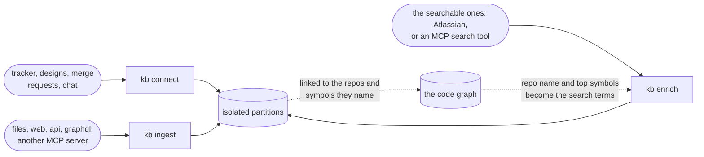

# Connect and enrich

Beyond code, contextlake links each repo to its external context (issues, docs, and designs) and can pull
grounded facts from those sources into the knowledge layer. `connect` links repos to items; `enrich`
queries connected sources with codebase-derived terms and stores what comes back.



<div class="dg-key">
  <i><b class="dg-sh-step"></b>a rectangle is something that runs</i>
  <i><b class="dg-sh-store"></b>a cylinder is something that persists</i>
  <i><b class="dg-sh-act"></b>a rounded box is a start or an end point</i>
</div>

Each stage writes its own partition, so re-indexing a repo's code never disturbs its external links.

## Connectors

`connect` enriches the graph with external context. Four connectors ship, sharing one seam:

- **Atlassian**: links each repo to the Jira issues and Confluence pages it references. Issue keys
  harvested from branch/commit names are confirmed against the live tracker (one batched JQL call per site
  prunes false positives and fetches each issue's summary/status), and Atlassian URLs in docs are
  classified into issue/page links. It talks to one or more Atlassian sites over MCP, each independently
  authenticated. **Per-symbol attribution**: an issue key found in a specific symbol's own docstring, or
  in the git-blame commit message on its defining line, becomes a `tracked_by` edge sourced from that
  *symbol* (not just the repo), confirmed by the same batched JQL call and shown as the dashboard blast
  radius page's **Ticket** breadcrumb, distinct from the repo-level **Links** crumb.
- **Figma**: links repos to the design files they reference, classifying `figma.com` URLs to a stable file
  key. If a Figma MCP is configured, each reachable design's real metadata (a name and/or top structural
  frame/page names) is merged in on top of the URL-slug title, which is always the fallback.
- **GitLab**: links each repo to its open **merge requests and issues** (read through your authenticated
  `glab`).
- **Zendesk**: links repos to the support tickets and Help Center articles about them, classifying
  `*.zendesk.com` URLs to a ticket id (`repo --discussed_in--> issue`) or an article id
  (`repo --documented_by--> document`). **It makes no network call**, which makes it the one connector
  that runs inside the offline boundary rather than as an opt-in exception to it: Zendesk's API needs a
  per-instance token, and the association is already stated by the link itself. The cost is that a ticket
  node carries no subject line -- an article gets its title from the URL slug, a ticket has none to get,
  and inventing one would state something the graph cannot support. Node ids carry the instance
  subdomain, because ticket numbers restart at 1 per instance. `hosts` is configurable for an instance
  served from a vanity domain; the default claims only `*.zendesk.com`, since claiming an arbitrary host
  would take links belonging to another connector.
- **Slack**: links repos to the channels and messages that discuss them, classifying `slack.com` permalinks
  (`/archives/<channel>` and `/archives/<channel>/p<ts>`) into channel/message links. Reachability is
  checked best-effort over a configured Slack MCP; there's no single spec-mandated tool name across Slack
  MCP servers, so the verification tool name is configurable (`verify_tool`, default `conversations_info`),
  as is the tool used to read a channel's recent messages (`history_tool`, default `conversations_history`).
  Any code symbol those messages mention by name is linked straight to the channel.

Adding another connector is a small, self-contained module, and its output lands in an isolated graph
partition, so re-indexing a repo's code never disturbs its external links. Configure connectors by copying
[`examples/kb.toml.example`](../examples/kb.toml.example) to `~/.contextlake/kb.toml`.

## Managing sources: the `source` command family

Editing `kb.toml` by hand works, but for everyday use `contextlake kb source` commands let you add, test, and
manage connectors without touching the config file. They rewrite `kb.toml` while preserving your comments,
and work alongside hand-editing if you mix approaches.

The commands:

- **`contextlake kb source add [--name NAME]`**: guided prompt to add a new connector. Asks for the connector
  type, offering every type this build ships, the five connectors (`atlassian`, `figma`, `gitlab`, `zendesk`,
  `slack`) plus the built-in ingest sources (`files`, `web`, `api`, `graphql`, `mcp`) and any
  installed plugin, provides sane defaults, and writes the entry to `kb.toml`. Pass
  `--type`, `--name`, and other flags to bypass the prompt (`--help` shows all). `--set KEY=VALUE`
  (repeatable) writes any connector option `kb.toml` accepts, `token_env` included (see below): `--set
  token_env=MY_TOKEN` is the flag form of that same pattern. **`--from-stdin KEY`** reads that one option's
  value from stdin instead of the command line, so a secret never lands in shell history: `printf '%s'
  "$TOKEN" | contextlake kb source add jira --type atlassian --from-stdin token`.

- **`contextlake kb source list`**: show all configured connectors (the effective merged config from
  `~/.contextlake/kb.toml`, the nearest ancestor directory's `.contextlake.kb.toml` if one exists, and
  the built-in defaults), with
  reachability status.
- **`contextlake kb source test SOURCE`**: verify that a specific connector works. Reaches its API, reads
  credentials from the configured env var, lists available items. Shows you exactly what each source will
  ingest without running a full `connect`.
- **`contextlake kb source enable|disable SOURCE`**: toggle a connector on/off in the config by name, so you
  can pause one without deleting it.
- **`contextlake kb source remove SOURCE`**: delete a connector entry by name.

An example workflow:

```bash
contextlake kb source add                # interactive: what type? which workspace?
contextlake kb source list               # show what you've configured + status
contextlake kb source test my-atlassian  # does it work? what's in scope?
contextlake kb connect                   # now link repos to their items
```

`init` can also prompt you to connect a source during first-run setup, and `doctor` reports per-source
reachability as part of its environment check, so hand-editing is optional; the CLI guides you through the
whole flow.

**Every fact carries its receipt.** Each is provenance-stamped (source file + verified date) and
confidence-tagged as one of three tiers, **`EXTRACTED`** (read straight from source/AST), **`INFERRED`** (a
resolved call or link), or **`AMBIGUOUS`** (an unconfirmed candidate), and sanitized before it reaches an
agent. The dashboard and the graph legend use these same tiers.

## Query-driven enrichment

`contextlake kb enrich` performs **query-driven enrichment**: it derives search terms from each repo's code
graph (the repo's name and its top symbols by graph degree) and queries your connected sources (Atlassian
Rovo search, or any `mcp` source with a `tool` and `arg_template` configured) with those terms, then stores
the returned documents in a searchable, embedded `@enrich:<repo>` partition, idempotent and re-runnable
across the whole fleet or a single repo:

```bash
contextlake kb enrich --workspace ~/work     # all indexed repos
contextlake kb enrich acme/catalog-api         # one repo
```

Prerequisites: the code graph must be **indexed first** (`contextlake kb index`), and at least one
term-searchable source must be configured: either an `mcp` source with `tool` and `arg_template` keys, or
an `atlassian` source. Sources without these capabilities (e.g. a plain `files` or `web` source) are
skipped gracefully. Each repo's enrichment documents are stored in their own partition so they can be
re-fetched without clobbering prior results, and are embedded (when the semantic tier is enabled) so they
surface in semantic search results as `document` nodes tagged with their source (`attrs.source`). A result
that names one of the repo's symbols is also linked straight to it (`documented_by`), so the enrichment
lands on the graph rather than beside it. After
`contextlake kb wiki` runs, enrichment docs are incorporated into the curated wiki as an attributed "External
context" section, grounded to the code graph's terms.

Configuring document sources, including the built-in `files` source, plugin packages and MCP endpoints, is in [Document sources and RAG](document-sources.md).

## When a source stops answering

`connect` and `enrich` are the only stages that leave the machine, and a fleet run asks each source once
per repo. If a source goes down mid-run, contextlake stops asking it rather than paying its `timeout` on
every remaining repo: after three consecutive failures the source is skipped for 60 seconds, then one
call is let through to see whether it came back. A run against an unreachable MCP server finishes in
seconds instead of `timeout x repos`.

You will see this in the output, it is never silent, because "the source was down" and "the source had
nothing" would otherwise look identical:

```
resilience: circuit OPEN for mcp:npx:https://mcp.example.test after 3 consecutive
  failure(s) (TimeoutError) -- further calls are skipped for 60s
resilience: skipping mcp:npx:https://mcp.example.test for 60s -- circuit open after 3
  consecutive failure(s) (TimeoutError); results from this source will be incomplete
```

The name in that line identifies the endpoint by transport and host only, never the rest of the URL,
since a hosted MCP endpoint can carry a token in its path or query.

Failures the *server* rejected rather than failed on, an unknown tool, a bad token, are reported as
themselves and never trip the skip: no amount of waiting fixes a wrong request. Raise `timeout` on the
source if the server is merely slow.

## When one repository is unreadable

A repository that fails outright costs that repository, not the run. `connect` names it, skips it, and
carries on with the rest:

```
  api-gateway: 'utf-8' codec can't decode byte 0x96 in position 99486: invalid start byte
⚠ Connect complete: 143 external link(s) stored
⚠ 1 of 20 repo(s) failed and were skipped; the rest were enriched. Re-run to retry
  them, or narrow with `contextlake kb connect <repo-id>`.
```

The exit code is non-zero when any repository was skipped, the same verdict `kb index` gives a
workspace where one repo failed to parse: the graph an agent will cite from is not the one you asked
for, so the run should not read as clean.

## See also

- [Index the code graph](indexing-the-code-graph.md)
- [Semantic search](searching-semantically.md)
- [Serve it to your editor](serving-over-mcp.md)
