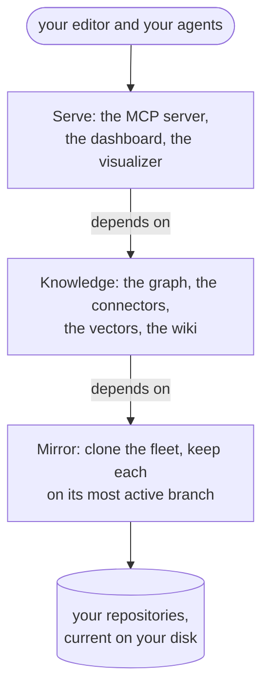
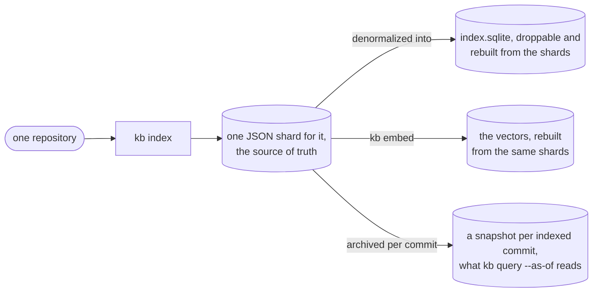
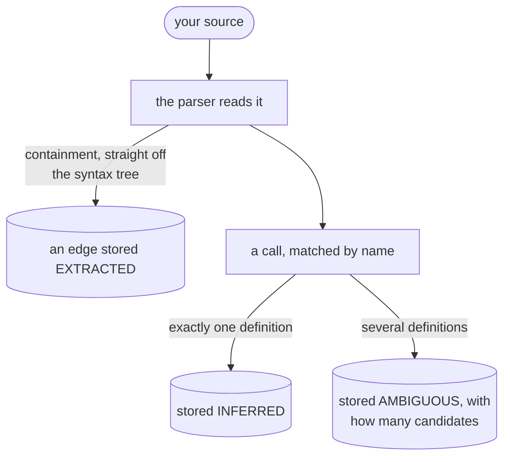
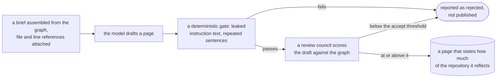

# contextlake, explained

What changes on your screen when you attach contextlake to an AI tool, what is underneath that,
and why each part is built the way it is. Read the first section and stop, and you will still have
a whole answer; each section after it goes one level deeper.

This is the page for deciding whether to adopt contextlake and for understanding the reasoning
behind it. For getting it running, start at [Install and upgrade](install.md) instead.

The shape of the whole thing, before any of the detail:

  <i><b class="dg-sh-step"></b>a rectangle is something that runs</i>
  <i><b class="dg-sh-store"></b>a cylinder is something that persists</i>
  <i><b class="dg-sh-act"></b>a rounded box is a start or an end point</i>

Every diagram on this page uses that same vocabulary.

## The problem, in one example

Ask a coding assistant *"where is the retry logic in this project?"* and it answers, confidently.
It may even be right. But it is pattern-matching against the millions of projects it saw in
training, not reading yours, and a fluent guess and a correct answer look identical. So you check
every one, which is most of the value gone.

Here is the same question, without and with a knowledge layer attached.

**Without.** "Retry logic is typically implemented in a `utils/retry.py` module using exponential
backoff with a decorator. You'll usually find it wrapped around HTTP calls."

Plausible, generic, and possibly describing a different codebase entirely. There is nothing in it
to verify.

**With.** "`retry_with_backoff` is defined in `acme/billing-service`, at
`src/billing/http.py:214`. Three call sites depend on it: `charge` (`src/billing/charge.py:88`),
`refund` (`src/billing/refund.py:41`), and `sync_ledger` (`src/billing/ledger.py:302`). Those are
`calls` edges, resolved by name and so marked `INFERRED`; the `contains` edge placing the function
in that file is `EXTRACTED`."

Every claim carries a location, and every location came out of a parse of your source rather than
out of a model's memory. You can open the file. And the second half of that answer is the part
worth noticing: the tool distinguishes what it read from what it deduced, rather than presenting
both with the same confidence. That distinction is [its own section below](#confidence-and-provenance).

That difference is the whole product. Everything below is the machinery that makes the second
answer possible, and the reasons it is shaped that way.

### What produces the citation

Not prompt engineering, and not the model being careful. A node in the graph carries `file`,
`line_start` and `line_end` as first-class fields, and an edge carries `provenance`, which is a
required `source_file` plus `source_line` plus `verified_at`
(`Node` and `Provenance` in `src/contextlake/kb/model.py`). An assistant reporting
`src/billing/http.py:214` is reading a column, not composing a sentence. The model docstring in
that file states the intent plainly: the anti-hallucination contract is structural, not advisory.

## What it is: three layers you adopt one at a time

| Layer | What it does | What you get without the next one |
| --- | --- | --- |
| **Mirror** | Clones every repository you can reach on a GitLab group, GitHub org, Bitbucket workspace or Gitea owner, keeps each on its most active branch, and keeps them current | A local, always-fresh copy of the fleet. Useful on its own, with `grep` if nothing else |
| **Knowledge** | Parses that source into a typed graph, links it to your tickets and designs, embeds it for meaning-based search, and writes a cited wiki | Terminal answers: [Ask the graph](ask-the-graph.md) |
| **Serve** | Exposes the graph over MCP, plus a local dashboard and a graph visualizer | Answers inside your editor and your agents |

Each layer depends only on the one below it, never sideways and never upward:

  <i><b class="dg-sh-step"></b>a rectangle is something that runs</i>
  <i><b class="dg-sh-store"></b>a cylinder is something that persists</i>
  <i><b class="dg-sh-act"></b>a rounded box is a start or an end point</i>

Only the first layer is required. `pip install contextlake` pulls exactly one dependency
(`argcomplete`, declared in `pyproject.toml`), which is a deliberate constraint rather than an
accident: keeping several hundred repositories cloned and current should not require a
machine-learning stack to be installable. The knowledge layer is the `[kb]` extra and needs
Python 3.10 or newer, because the `mcp` SDK does.

Everything runs on your machine. The repositories, the graph, the vectors and the generated prose
are local files. The only outbound traffic is cloning from your own git host, the optional
connectors, and a model provider if you choose one that is not local.

## Why it is built this way

Each of the decisions below is recorded in the source with the alternative it turned down, so what
follows is the project's own reasoning rather than a reconstruction of it. Where the codebase does
*not* record a reason, this page says so instead of inventing one.

### The store is a file, not a service

Everything persists in two SQLite databases plus a tree of JSON files, under one store directory
(`~/.contextlake/kb` by default, `DEFAULT_STORE_DIR` in `src/contextlake/kb/config.py`). There is
no daemon to start, no port to bind and no credential to manage, and SQLite ships inside Python, so
the graph tier adds no install surface beyond the parsers. Keyword search is the `node_fts` FTS5
virtual table in that same schema, rather than a separate search engine.

The honest caveat: the codebase does not record a comparison against a graph database. What it does
record is the shape of the trade it *is* making, which is a single-machine tool with one writer.
Two contextlake processes aimed at one store are refused by an advisory lock naming the process
that holds it, rather than interleaved.

### The database is not the source of truth, and a monolithic graph was rejected

Each repository's parse result is its own JSON shard; `index.sqlite` is a denormalized index built
from those shards and can be dropped and rebuilt at any time. The reason is written down in
`src/contextlake/kb/store/shards.py`: a shard is self-contained, so a repository can be re-indexed
in isolation and shards stay small, "sidestepping the single-global-graph size ceiling that a
monolithic graph would hit at scale".

The consequences you can feel: a corrupted index is an inconvenience rather than a re-parse of the
fleet, and the authoritative form stays readable with ordinary tools. Every shard is also
snapshotted per indexed commit under `history/`, which is what makes `kb query --as-of <commit>`
work at all.

One arrow in that picture is the source of truth and the rest is derived:

  <i><b class="dg-sh-step"></b>a rectangle is something that runs</i>
  <i><b class="dg-sh-store"></b>a cylinder is something that persists</i>
  <i><b class="dg-sh-act"></b>a rounded box is a start or an end point</i>

Delete the index or the vectors and an index run puts them back. Delete the shards and you are
re-parsing the fleet.

That same module also retracts a claim it used to make, which is worth reading if you were thinking
of hashing shards: snapshots overwrite identically only for the same commit, *the same parser
version, on the same machine*, because file nodes are emitted in `os.walk` order and that is
filesystem-dependent. It is a reliable answer to "did this local store change" and not a basis for
content-addressing across machines.

### An open vocabulary for kinds and relations

A node's `kind` and an edge's `relation` are plain strings, not enums, and
`src/contextlake/kb/model.py` states the reason in its module docstring: they are open "the way
Graphify treats them", so a new parser or connector can introduce a new kind without a schema
migration. `table`, `route`, `endpoint`, `adr` and `state` all arrived that way.

The trade is real. Nothing stops a typo becoming a new kind, and the containment is convention
rather than a constraint.

### Caching bounded by memory, not by entry count

A small decision with a measurement attached, and a good example of the house style. The shard
cache is capped by estimated resident bytes rather than by number of entries, because parsed
objects cost far more memory than their JSON: measured at roughly 13 times on a real
20,000-node, 97,000-edge shard, 27.6 MB on disk against about 363 MB resident
(`src/contextlake/kb/store/shards.py`). An entry-count cap of, say, 256 would pin dozens of large
shards in memory before it ever fired, which on the multi-hundred-repo fleets this is for trades a
latency bug for an out-of-memory one.

### The repository-list cache moved out of `/tmp`, for three stated reasons

The mirror's cache names every repository your account can enumerate, together with its clone URLs,
which makes its location a privacy decision rather than a scratch-file one. It used to default to
`/tmp`, and `src/contextlake/config.py` records why that was wrong on three counts: `/tmp` sits
outside the user's home, so no HOME-based isolation reaches it; it is world-readable on a shared
host; and its path is predictable, so another user can pre-create a file or symlink there first.
It now defaults under `~/.cache/contextlake`, in a per-workspace subdirectory created `0700`.

A directory *you* configure explicitly is created but never re-permissioned, on the grounds that
silently changing the mode of a path you pointed the tool at is a side effect nobody asked for.

### Config that can run a program is trusted by provenance, not by content

Config is discovered by walking up from the current directory, the way git finds `.git`. That is
the feature, and it is also a hole: a config file can arrive inside a repository you cloned. The
settings that would cause contextlake to *run a program* are therefore honoured only from a file
you named with `--config` or from your own home config.

`src/contextlake/kb/trust.py` records both alternatives it turned down. Distrusting a
directory-scoped file wholesale was rejected because directory-scoped config is the point, and a
project-local `store_dir` or `languages` should keep working. A separate trust registry
(`contextlake trust <path>` plus a trusted-paths file) was rejected as a new top-level CLI surface
belonging to neither namespace, when `--config PATH` already means "I meant this file".

### Parser staleness is repaired, not just reported

The clearest recorded reasoning in the project, because it documents a failure it shipped. When
`PARSER_VERSION` moved to `2`, the staleness check only examined C and C++ repositories and the
re-index decision compared the repository HEAD alone. A Python or TypeScript repository indexed by
the previous major therefore stayed stale indefinitely: `index` reported it unchanged, `doctor`
reported OK, and every answer came from a graph built by the old parser while every surface said
healthy.

`kb index` now re-indexes a repository whose recorded parser version differs from the running one
even though its HEAD has not moved, and says so. The comment in
`src/contextlake/kb/cmds/index.py` states the reasoning: the alternative is "a green 'unchanged'
over a stale graph, and no amount of wording makes that safe".

`kb lint` deliberately went the other way and keeps parser staleness *out* of its exit code, on the
grounds that such a graph is out of date rather than broken, and folding it in would turn every
upgrade into a red CI gate. Two commands, opposite calls, each with its reason written down.

### Serving over MCP

MCP is an open protocol for letting an assistant call external tools, and it is what editors and
agents already speak, so wiring contextlake into one is a config entry rather than a client-side
integration. (That is an observation about the protocol, not a decision record; the codebase does
not argue the case against an API of its own.)

21 tools are registered unconditionally; `semantic_search` and `hybrid_search` bring it to
23, and register only when an embedder and a vector store both exist
(`build_server` in `src/contextlake/kb/server.py`). A server started without embeddings says so
and serves the other 21 rather than failing.

### Why the network transports are authenticated and stdio is not

`stdio` is the default: your editor spawns the server as a child process and talks over a pipe it
owns, so there is nothing to authenticate against. The HTTP transports are different, because a
socket that answers with real file paths, symbol names and owner identities is worth protecting.
They require a bearer token on every request, validate `Origin` and `Host` against the bound
address, and refuse a non-loopback bind unless you pass `--allow-remote`.

The token gate is ASGI middleware wrapping the whole application
(`BearerAuthMiddleware` in `src/contextlake/kb/server.py`), which has a consequence worth knowing
before you debug it: an unauthenticated request to *any* path, the root included, gets `401`, not
`404`. Nothing is encrypted in transit; for anything past your own machine, put TLS or an SSH
tunnel in front. See [Serve it to your editor](serve.md).

## Confidence and provenance

This is the design decision the rest depends on, so it gets its own section.

Every edge in the graph records how it was derived. Not as an annotation somebody remembered to
add, but as a required field on the model: `Edge.confidence` and `Edge.provenance` have no
defaults (`src/contextlake/kb/model.py`).

| Confidence | Means | Comes from |
| --- | --- | --- |
| `EXTRACTED` | Read directly out of the source. Ground truth | Containment and imports straight off the syntax tree; a manifest that literally names the dependency; a merge request whose diff demonstrably touched a file |
| `INFERRED` | Deduced. Probably right, not proven | A call resolved by name to exactly one definition; a foreign key recognised by pattern; an HTTP route matched to its handler |
| `AMBIGUOUS` | Genuinely uncertain, flagged for a human to settle | A name that resolves to several definitions and could mean any of them; a free-text mention of a symbol in a ticket or a message |

Note where the line falls, because it is stricter than you might guess: "this file contains this
class" is `EXTRACTED`, and "this function calls that one" is `INFERRED`, because the call is matched
by name and a name can lie. A call that matches several definitions is `AMBIGUOUS` rather than
resolved to a favourite, and one that matches more than a cap is dropped rather than degraded.

Where each of the three verdicts comes from. All three carry the same required provenance, a
`source_file` plus a `source_line` plus a `verified_at`; what differs is how much the edge is
worth:

  <i><b class="dg-sh-step"></b>a rectangle is something that runs</i>
  <i><b class="dg-sh-store"></b>a cylinder is something that persists</i>
  <i><b class="dg-sh-act"></b>a rounded box is a start or an end point</i>

The alternative is a graph that records only the relationship. It is smaller, faster to build, and
it makes every fact sound equally certain, which is precisely the failure this tool exists to fix.
With confidence recorded, an assistant can state a containment as fact, hedge on a name-matched
call, and say it does not know when the graph does not know. Without it, the assistant is back to
sounding confident about everything.

`kb impact` is where you see it pay off: incoming edges are walked highest-confidence first, so
when a result is truncated at `--limit`, what you kept is the trustworthy part rather than an
arbitrary slice.

### What an inferred edge is actually worth

Rather than describing inference as accurate, the SQL extractor's inferred foreign keys are scored
against a hand-labelled corpus on every CI run: **precision 1.00 and recall 0.69** against
13 ground-truth edges (`tests/kb/fixtures/sql/`, scored by
`tests/kb/test_sql_fixture_corpus.py`, which also asserts that these pages quote what it measures).
Both documented gap classes, and the false positive that masking comments removed, are written down
in [Index the code graph](index-code-graph.md#databases-sql-ddl).

That is a small synthetic corpus and not a claim about your codebase. It is published because
"how much should I distrust an `INFERRED` SQL edge" is a question with a number, and a number you
can reproduce is worth more than an adjective.

## Generated prose, and how it is kept honest

A graph answers precise questions well and vague ones badly. "Who calls this function" is a
traversal; "what does this service do, and why" is not stored anywhere and has to be written. So
contextlake generates a wiki, which reintroduces exactly the risk it exists to remove: a model
writing about code will invent things.

Four mechanisms constrain it, and the third is the most interesting because of what it says about
the second.

1. **Grounding.** The model is handed a brief assembled from the graph, with file and line
   references already attached, and asked to organise evidence rather than recall it.
2. **A review council.** A second pass scores the draft against the graph. Pages below the accept
   threshold are reported as rejected rather than published, with per-lens reasons.
3. **A deterministic gate that runs before the council.** Added because the council was measurably
   not enough: in a controlled run the shipped default provider scored a page that was one
   sentence repeated 32 times at 0.967, the highest of that run, and accepted another whose
   "Gotchas" section was the prompt's own guardrail reproduced word for word. Self-review is not
   independent, so a model's failure modes are invisible to it, and a stronger judge moved those
   verdicts without making them reliable.
4. **Coverage honesty.** Each page states how much of the repository it reflects, and very large
   repositories get a page per subsystem rather than one page claiming to cover everything.

In run order rather than in the order above, because the deterministic gate is deliberately in
front of the council:

  <i><b class="dg-sh-step"></b>a rectangle is something that runs</i>
  <i><b class="dg-sh-store"></b>a cylinder is something that persists</i>
  <i><b class="dg-sh-act"></b>a rounded box is a start or an end point</i>

The gate's thresholds are measured, not picked. Pages a human judged sound share no run of even
six normalized words with the instruction text, while the leaking page shared a run of 61, so the
instruction-leak rule fires at 12. The highest legitimate sentence repeat across the same corpus is
4 and the degenerate pages hit 31 and 32, so the repetition rule fires above 8
(`_LEAK_RUN_WORDS` and `_MAX_REPEATS` in `src/contextlake/kb/wiki/validate.py`, each with the
measurement in a comment beside it).

That module is also candid about its ceiling, which is the honest version of this section: it
checks structure, not truth. One page passes the gate while claiming its module is the only module
in the repository. A well-formed page is not a correct one.

## How contextlake compares

The thing other local code-context tools do not center on is a **continuously mirrored fleet
rather than a single indexed folder**. Point contextlake at a group, an org or a workspace and it
keeps every repository checked out on its most active branch, refreshed on a schedule, with the
graph, search and wiki built across all of them at once.

**[Graphify](https://graphify.com/)** parses a single codebase with tree-sitter into an
AST-derived graph, on-device, with no vector index and no generated wiki by design. So there is no
meaning-based search when you have the concept and not the symbol name, no generated prose about
what a service does, and its quickstart runs against one project at a time. contextlake's open
`kind`/`relation` vocabulary is borrowed directly from how Graphify treats them, and says so in
the source.

**[GitNexus](https://github.com/abhigyanpatwari/GitNexus)** reaches for several of the same
pieces: a graph, vectors, a wiki, MCP serving. The difference is upstream of all of them. GitNexus
indexes what you point it at, on demand: a repo, a ZIP, a URL. contextlake maintains a standing
mirror of an entire group, tracking each repository's most active branch over time, so you wire an
editor once and repositories appear in it as they are added rather than per project.

**[DeepWiki](https://deepwiki.com)** turns a GitHub repo into an AI-generated wiki on demand,
with citations, diagrams and a free MCP server. It solves a real problem, a different one: the
free tier reaches public repositories, running your own through it privately is a paid path with
your source going through someone else's infrastructure, and each wiki is scoped to one repository
with no fleet underneath it. contextlake's equivalent is a standing local asset you can query
offline and indefinitely.

If your problem is "one repository and I want a good wiki for it", those tools are aimed at you.
If it is "hundreds of repositories and no single place that knows all of them", that is what this
is built for.

### Four differences that do not depend on which repository you try

Graph size varies a lot with the shape of the tree, so any claim about it needs a benchmark and a
caveat. These four do not. They are properties of the design, each one a line you can go and read.

- **Every edge records where it came from.** `source_file` and `source_line` sit on the edge row
  itself, not on the node (`src/contextlake/kb/store/sqlite_store.py:58`). That is what lets an
  answer say which line made it believe two things are connected, instead of only that they are.
- **Offline is a mode, not a hope.** `--offline`, or `CONTEXTLAKE_OFFLINE=1`, raises instead of
  connecting (`src/contextlake/netguard.py`). You can turn the network off and watch it keep
  working, which is a different claim from "it happens not to call out today".
- **No telemetry, and it turns off someone else's.** contextlake reports nothing anywhere, and it
  sets `HF_HUB_DISABLE_TELEMETRY=1` so a model download does not report on your behalf
  (`src/contextlake/kb/_util.py:53`).
- **Diagrams come out of the graph.** `kb graph` renders the same store you query, to HTML, DOT,
  Mermaid, GraphML or Cypher, so the picture and the answers cannot disagree with each other.

### And a benchmark that does not flatter us

`benchmarks/head-to-head/` runs contextlake and a comparable local tool over four pinned public
repositories and commits the harness, the tree list and the raw output. **contextlake leads on one
tree of four.** It is ahead on a modern C++ tree, split on a mature C tree, and behind on Python
and on JavaScript, where the gap is more than 3x.

The largest gap has a cause worth stating: contextlake emits no node for a variable or a constant,
in any language, and on the JavaScript tree that single missing category is most of the difference.
Both tools read the same files. Read `benchmarks/head-to-head/RESULTS.md` for the numbers, and re-run
it if you doubt them.

## What it is not good at

The honest list, because a tool that only publishes its wins is being sold to you rather than
described.

- **Greenfield work in an empty repository.** There is nothing to ground against, so the benefit
  is close to zero. Everything this tool does well is grounding new code in an estate that already
  exists ([what it saves, and how to measure it](benchmarks.md)).
- **Making one correct generation shorter.** The code you need is the code you need. What drops is
  the number of attempts, and that is a mechanism argument, not something measured.
- **Semantic recall.** The built-in CPU embedder is fast, not frontier-grade. Results are cited
  and advisory; verify them.
- **Wiki quality on the smallest local model.** The default 0.5B model produces pages the council
  frequently rejects, and reviews it cannot parse. A capable backend changes this
  ([Model providers](model-providers.md)).
- **Scale beyond one machine.** Single writer, local files, no clustering, no multi-tenancy.
- **Encryption in transit.** The HTTP transports authenticate but do not encrypt.
- **Some structure is skipped rather than guessed at.** Framework routes, realtime channels,
  templates and stylesheets are named as not-extracted rather than half-extracted, and inferred
  SQL foreign keys miss about three in ten.
- **A fixed cost per agent session.** The tool schemas (21, or 23 once embeddings exist) load once
  whether or not a tool is called, which can be net-negative if the agent calls it for questions it
  does not help with.

## See also

- [Benchmarks](benchmarks.md), where the token and correctness impact comes from, and how to measure
  it on your own repositories
- [Install and upgrade](install.md), if you have decided to try it
- [Architecture and internals](internals.md), the same machinery at implementation depth
- [Ask the graph](ask-the-graph.md), the questions this page promised you can ask
- [Index the code graph](index-code-graph.md), what the graph actually contains
