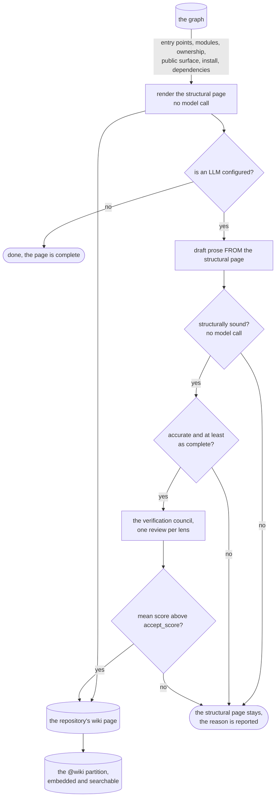

# Generate the wiki

Every indexed repository gets one wiki page per scope, and it exists the moment the repo is indexed.
`contextlake kb wiki` writes a **structural page** built entirely from the graph, the manifests and
the checkout, with no language model involved. If an LLM is configured, it then drafts prose from that
page, and the prose replaces it only when the prose is at least as accurate and as complete.

So the page you read is one of two things, and it always says which.



<div class="dg-key">
  <i><b class="dg-sh-step"></b>a rectangle is something that runs</i>
  <i><b class="dg-sh-store"></b>a cylinder is something that persists</i>
  <i><b class="dg-sh-act"></b>a rounded box is a start or an end point</i>
  <i><b class="dg-sh-dec"></b>a diamond is a decision</i>
</div>

## The structural page

It carries seven sections, and any section with nothing in it is omitted and named at the end, so an
absence never reads as an oversight:

1. **Entry points and how to run it** -- `main` and its equivalents, HTTP routes, Make targets,
   Dockerfile stages.
2. **Getting started**, the ordered path a newcomer takes: install what the repo declares, run
   its entry point, read the symbol everything routes through, run the tests, and find who to
   ask.

   Three rules keep it honest. Every step restates a fact from another section and links to it,
   instead of copying detail that could drift. A step with no evidence is dropped, not written
   as "none found". The section says up front that it was assembled from the graph, because
   nobody wrote this procedure and a reader who thinks otherwise will trust it too far.
3. **Architecture** -- the repository's modules and their sizes.
4. **Ownership and activity** -- who has been working here lately, as a share rather than a commit
   scoreboard. Pseudonymised when `[kb] anonymize = "always"`.
5. **The public surface** -- the named symbols, most-called first, with caller counts where the graph
   records any.
6. **Installation and usage** -- the build and packaging files the repository actually has.
7. **What this repository contains** -- languages, node kinds, and **the repositories it depends on and
   that depend on it**. That last pair is a cross-repository answer no single-repo tool can give, and it
   is always labelled as describing the whole repository even on a module page, because it cannot be
   scoped to one.

Large repositories also get one structural page per module, under `wiki/_modules/`.

## When prose may replace it

Passing the council is not enough, and cannot be: a council judges a page on its own terms and has
never seen the page it would displace. Prose must also be

- **accurate** -- every name it cites in backticks appears in the structural page. Sound because that
  page is the prompt, so a name that is not in it was invented rather than read; and
- **complete** -- every section the structural page filled is addressed.

Strict on purpose. A page covering four of seven sections would otherwise replace one that covered seven.
**Expect drafts to fail this**, and expect to keep reading the structural page on some repositories
even with a strong model configured. That is the bar working rather than the feature failing; the reason
is printed either way.

A rejected or failed generation therefore leaves the structural page exactly where it was.

The council can be pointed at a different, usually stronger, backend than the one that drafted the page,
which is what makes publishing from a cheap local generator safe.

## Running it

Two ways to turn the tier on.

- **In the config**, by enabling `[llm]`. Generation runs on a local Ollama model by default, so
  prompts never leave the machine.
- **Inline**, with `--llm <provider>`, skipping the toml entirely. Providers: `builtin`,
  `ollama`, `openai`, `anthropic`, `cli`, `auto`.

For example, `contextlake kb wiki acme/catalog-api --llm builtin` enables the tier and scopes
generation to that repo.

`auto` picks for you, in order: a reachable local Ollama that already has the model pulled, else
the built-in CPU model, else it skips the tier. See [Model providers](model-providers.md).

On a `pip` install, `--llm builtin` needs one extra step first, `contextlake doctor --fix llm-local`
(see [Install and upgrade](installing.md#the-built-in-wiki-llm-is-one-extra)); `--llm ollama`
needs no compiler at all.

Run `contextlake kb wiki`. For each repo it writes a Markdown page grounded strictly in graph
facts: top symbols, dependencies and files.

When the repo's own checkout is available, it also uses an excerpt of the README and which
conventional entry-point or config files exist, such as `package.json`, `Dockerfile` or
`manage.py`.

Every page carries a provenance footer citing the commit and the sources.

The draft then goes through a **verification council**. Reviewers score it for accuracy,
completeness and clarity, and a chairman publishes only pages above a configurable threshold.
**Nothing that fails review is written.**

By default the council reviews with the **same model that wrote the page**, so a small local model both
drafts and grades its own work, and the tiny built-in 0.5B in particular tends to rubber-stamp almost
everything. To gate a cheap local generator with a stronger judge, point the council at its own provider:

```toml
[llm]
provider = "builtin"           # keep generation local and free
review_provider = "anthropic"  # …but have a real model decide what gets published
review_model = "claude-haiku-4-5"   # optional; defaults to the provider's own default
```

`review_provider` takes the same values as `provider`, and always wins. So the reverse split
also works: generate with a strong model, review with a cheap one.

It is strictly opt-in, and never inferred from a stray API key in your environment, because it
is not free. A run makes **pages x `council_size`** review calls against that provider. The
default is 3 lenses per page. Set `council_size = 1` to cut that threefold.

One thing to watch: `contextlake doctor` checks the *generation* provider only. A missing key for
the review provider shows up as a run where every page is rejected with
`N reviewer(s) returned nothing parseable`, not as a doctor warning.

The number of symbols sampled into that grounding set scales with the repo's size, rather than
being a flat 15:

    max(15, min(80, node_count // 1500))

- Up to 22,500 nodes the floor keeps it at 15, so nothing changes for small repos.
- Past that it grows with the repo, reaching its cap of 80 at around 120,000 nodes.
- A large repo therefore gets proportionally more grounding depth, and the prompt still costs a
  fixed amount.

Inside that sample:

- **`top_symbols` reserves at least one slot per symbol kind.** A SQL table node has no call
  edges, so pure degree ranking would squeeze it out entirely.
- **`hubs` and `dispatchers` do not backfill.** Both carry a real caller or callee count, and
  padding them with a fabricated zero-count row would make that claim false.
- **A file-less `module` node gets no reserved slot.** It is an import target, not a symbol the
  repo defines. It can still rank in on its own degree, as a heavily-included header does.

The provenance footer states the result as a fact: "Grounded in N/M file-backed symbols (X%)".
That is how many distinct symbols the sample touched, against the repo's file-backed symbol
count. Both sides count file-backed nodes only, so the ratio means the same thing on a
whole-repo page and on a per-subsystem page.

The page has a fixed section order: Overview, Setup & Run, Architecture, Dependencies,
Gotchas, Decisions.

**A section is written only when the graph has something to ground it.** A repo with no signal
for a section gets fewer sections, never an empty heading.

What each one needs:

- **Setup & Run** needs a README excerpt or a detected config file. It also flags any indexed
  file under a directory named `generated/`, so the model is warned off presenting generated
  code as hand-written design.
- **Gotchas** needs at least one symbol with real callers. It states only the count, for
  example "N caller(s) in the graph, worth extra care when changed". The model is told not to
  explain *why* a symbol has many callers, so it cannot invent a label like "foundational".

`setup_signals` also counts legacy C and C++ project files such as `.vcxproj` and `.dsp`, and
reports them by category ("3 legacy MSVC6 project (.dsp) file(s) detected"). Those extensions
are not in the indexed language set and never reach the graph, so the count comes from a
bounded scan of the live checkout. That is the same way `setup_signals` already finds
`package.json` and `Dockerfile`.

"External context", covered below, is a separate block layered on top of that list. It is
always conditional, and it is not one of the named sections.

For the LLM backends behind this (built-in CPU model, Ollama, OpenAI, Anthropic, or a local agent CLI),
see [Model providers](model-providers.md).

## Why a page was rejected

A rejection always names the rule that fired, because a page that simply fails to appear leaves you
staring at a missing file. Two of the reasons come from a **structural gate** that runs before the
council and makes no model call at all:

| Reason | What the draft did |
| --- | --- |
| `prompt leakage` | Reproduced one of its own instructions verbatim, so the page describes how it was asked to write rather than the repository. |
| `degenerate repetition` | Repeated one span over and over, which is what a model that has run out of grounded material tends to emit. |

Both are mechanically visible, so they are decided without asking a reviewer. That is deliberate: a
weak model acting as its own council rubber-stamps exactly these defects, which
[contextlake, explained](explained.md#generated-prose-and-how-it-is-kept-honest) records with the
measurement behind it. Rejecting them early also saves the council's round trips on a page that
could not have passed.

Anything else is a council verdict: the mean score across the lenses came in under `accept_score`,
and the reported issues are the reviewers' own. In every case the page is **skipped, not rewritten**,
so a rejection costs you that page rather than another round of model calls. Re-run with a stronger
backend, or a stronger reviewer, and it is attempted again from scratch.

## Steering it from the repository: `.contextlake/wiki.toml`

A repository can have a say in its own page. Drop a `.contextlake/wiki.toml` in its root:

```toml
# Free text the page quotes, attributed, above the sections.
notes = "This is a thin client. The behaviour lives in the server repo; prefer its docs."

# Optional. Names the subsystems that get their own page, replacing the automatic choice.
pages = ["api", "workers"]
```

**`notes` is quoted, never absorbed.** Everything else on the page is derived from the graph;
this is the repository asserting something about itself, and the page says so in those words
rather than blending it into its own voice. It is bounded (2000 characters, 10 notes) because
it lands verbatim in generated output. A note that is not a string is dropped rather than
having its repr printed into a wiki page.

There is no separate "send the notes to the model" step, and that is deliberate: **the
structural page IS the prompt**, so putting the notes on that page is what puts them in front
of the model on the prose path. One insertion point, both paths, and the replacement gate keeps
working -- a name the notes introduce becomes a name a draft may legitimately cite.

**`pages` steers, it cannot invent.** Names are matched against the modules the graph actually
found; anything unmatched is dropped with a warning. A file inside a cloned repository is
untrusted input, and this is the line that keeps it unable to fabricate a page. When every name
is unknown the automatic heuristic runs instead of producing nothing, so one typo cannot
silently delete a repository's whole module set on the next prune.

Nothing here runs a program, which is why it is honoured from an in-repo file at all: settings
that would execute something are refused from files found this way (`kb/trust.py`). Quoting a
repository's own prose is the same trust level as the README excerpt the page has always
carried.

## Per-subsystem pages for large, federated repos

A repo qualifies as **genuinely federated** when it has at least 5,000 graph nodes and no
single top-level module owns more than 60% of them. One big source directory does not qualify.
A repo split into several comparable subsystems does.

For those, `contextlake kb wiki` writes one extra page per subsystem automatically. No new flag.
These are added to the whole-repo page, never used instead of it.

Each subsystem page:

- is grounded only in that module's own symbols, files and dependencies
- respects segment boundaries, so a module named `api` never pulls in a sibling `apiv2/`
- says plainly in its title, framing and provenance footer that it covers one module

They live under `wiki/_modules/` with their own `@wiki:<repo>::<module>` partition. A
natural-language question can therefore land on a subsystem's own explanation, cited back to
that page.

Generation is capped at **20 subsystem pages per run**, so one `wiki` call on a very large repo
stays bounded.

Which 20 depends on what is already on disk:

1. Subsystems with no page yet, largest first by node count.
2. Then subsystems that already have a page.

A first run has no pages, so it becomes exactly "the 20 largest". Every run after that works
through the never-paged tail. This is how repeated runs cover the whole repo, instead of
re-picking the same top 20 forever.

The run says how many are still waiting, rather than going quiet about it:

    N qualifying modules, generating 20 this run (M deferred to a later run)

**Once subsystem pages exist**, the whole-repo overview names and briefly describes each one and
links to it, instead of summarising their internals inline.

One catch: the overview only picks that up the next time it is actually regenerated. A repo
already wiki'd at its current commit has its overview skipped as unchanged, though subsystem
pages still generate. So an existing store gets the naming after its next commit, or on a
`--force` run
(the dashboard's Regenerate button has a force option too).

## Searchable prose

Accepted pages also become **searchable prose**. Each page's sections are stored in an isolated
`@wiki:<repo>` partition, and embedded alongside the code vectors when the semantic tier is on.

So a natural-language question can land on the wiki's explanation of a subsystem. The answer is
cited back to the page file and labelled advisory, with kind `wiki`, so it never outranks
extracted code facts.

Pages written before this existed are backfilled on the next `wiki` run, with no LLM calls.

Each section is also **linked to the symbols it names**, with a `documented_by` edge. So
"where is this function explained?" is one graph hop from the symbol, not a text search.

- Module pages link through the repo they belong to, so subsystem pages link too.
- A cluster page spans many repos, so it links to none.
- Only symbols get these edges, never the repo itself. A repo's **Links** panel is for external
  knowledge such as Jira, Confluence, Figma and GitLab. A wiki page is contextlake's own output,
  so it does not belong there.

## Cluster (namespace) wiki

`contextlake kb wiki --namespace acme/payments` writes one **cluster page** for a whole group of
repos, meaning everything under that repo-id prefix. Use `--namespaces --depth N` to generate one
page per namespace at that depth.

A cluster page narrates how the repos fit together:

- which services call which over HTTP
- which events they publish and consume
- which packages they share

It splits coupling *inside* the namespace from coupling to repos *outside* it.

It grounds strictly in cross-repo edges the graph already resolved. No new extraction happens.
It reuses the same review council and provenance footer as a per-repo page, so it stays advisory
and cited. When the graph shows no coupling, it says so instead of inventing a link.

Cluster pages get the same fixed sections and the same nothing-invented rule. That includes a
"Gotchas" section when there is a real coupling risk to ground it:

- the highest-weight internal edges, meaning the busiest coupling in the namespace
- the member repos with the most boundary edges, whose changes are most likely to ripple outside

Both come straight off data the cluster brief already computes. No new metric.

You can reach cluster pages over MCP by passing a namespace to `get_wiki`, and they appear per
group in the dashboard's fleet overview.

## Incorporating connector enrichment

Once `contextlake kb enrich` has populated a repo's `@enrich:<repo>` documents, from Atlassian
or MCP search sources, the wiki adds an **External context** section to that repo's page.

Every external fact is quoted directly from its source, a Confluence page, a Jira issue or an
MCP search result, and attributed by URL or name. None of it is presented as a free assertion or
passed off as a code fact.

The council still gates the enriched page before it is written. External context supplements
code-backed facts, and never displaces them.

The result, rendered directly in the dashboard's Wiki tab (no click-through needed): prose grounded
strictly in real symbols, with a provenance footer citing the exact commit and source files it was built
from, and a **STALE** badge if the indexed commit has since moved.


With `contextlake kb dashboard --serve --allow-mutations`, both the per-repo Wiki tab and the fleet-wide
Settings tab also carry a **Regenerate** button that runs this same command from the browser, in the
background, see [The dashboard → Mutating routes](using-the-dashboard.md#11-mutating-routes).

## Recorded decisions

A repo's own ADR/decision docs (see [Index & Code Graph](code-graph-model.md#architecture-decisions-adrs))
are authored facts, not connector content, so they don't need attribution the way "External context"
does: each becomes a "Recorded decisions" section citing the decision's title, file, and body directly.
No `enrich`/`connect` step needed, these are picked up automatically whenever the repo is indexed.

## See also

- [Model providers](model-providers.md)
- [Connect and enrich](connecting-and-enriching.md)
- [The dashboard](using-the-dashboard.md)
