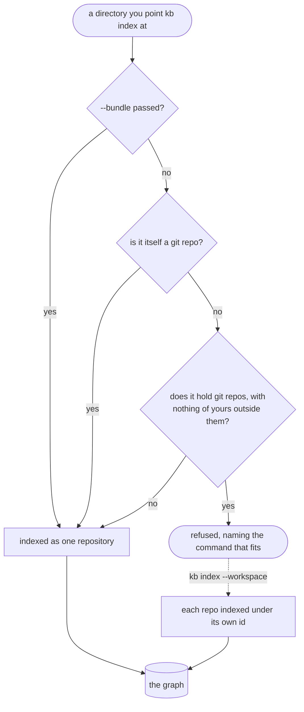

# Index the code graph

Indexing turns your mirrored repos into a queryable knowledge graph. `contextlake kb index --workspace
~/work` walks every git repo under a folder and builds the graph. Runs are incremental by default;
`--force` rebuilds from scratch.

<p align="center">
  
</p>



<div class="dg-key">
  <i><b class="dg-sh-step"></b>a rectangle is something that runs</i>
  <i><b class="dg-sh-store"></b>a cylinder is something that persists</i>
  <i><b class="dg-sh-act"></b>a rounded box is a start or an end point</i>
  <i><b class="dg-sh-dec"></b>a diamond is a decision</i>
</div>

The shape of the directory is measured before any of it is indexed, and the next section walks each
outcome.

## Which command for which directory

`kb index <dir>` indexes that directory as **one** repository. `kb index --workspace <dir>` walks it
and indexes **each** git repository under it separately, under its own identity. Getting those two
the wrong way round is the most expensive mistake available here, so a directory that is not itself a
git repository but holds some is **refused**, with the command that fits what was found:

```
$ contextlake kb index ~/work
✗ /home/you/work isn't itself a git repo, but contains 20 git working tree(s) at depths 1-2
  (alpha, beta, billing-core, frontend, gateway, …); no indexable file lies outside them.
  That is a workspace mirroring several repositories. Indexing it this way files all of them
  under ONE id, so every symbol they hold is in the graph twice and the copies cannot be told apart.
  → Run this instead, which indexes each repository separately under its own identity:
        contextlake kb index --workspace ~/work
  → Or pass --bundle to index this directory as one repository anyway. …
```

It refuses rather than quietly switching to `--workspace` for you, because switching can lose data:
`--workspace` indexes the nested repositories and nothing outside them, so on a tree of your own
loose sources that happens to carry a dependency with its own `.git` it would index the dependency
and drop your files. So the shape is measured first, from how much indexable content lies outside
the nested repositories, and only then does it decide:

| What the directory looks like | What happens |
| --- | --- |
| Several repositories, effectively nothing of your own outside them | refused; run `--workspace <dir>` |
| One repository, nothing at all outside it | refused; the directory is one level too high, and the command names the repository |
| Real content of yours outside the repositories (your sources plus a vendored dependency) | indexed as one repository, with a line saying so |
| A git repository (`.git` present), whatever it contains | indexed, no diagnosis at all |

**`--bundle` opts back in.** It indexes the directory as one repository regardless of shape, and it
is read before anything is measured, so it always works. Reach for it when you genuinely want one
bundled repository -- and note the cost you are accepting: the nested repositories' files are filed
under the directory's name, so if you later index them properly they are in the graph twice. `kb
forget <repo-id>` removes a bundle you did not mean to create.

## Incremental and time-travel

`index --workspace` is **incremental**, it re-indexes only repos whose git HEAD moved since their last
index, so a scheduled (cron) run stays cheap; pass `--force` to rebuild everything, or `--watch [--interval
N]` to keep re-indexing in a loop (the same `--watch` / `--interval` flags also drive `connect` and
`embed`). Every indexed snapshot is kept, so `query "<text>" --repo R --as-of <commit>` does
**time-travel**, it searches repo `R` as it was at a previously-indexed commit.

## Re-indexing one repository by its id

A repository's **id** is derived from its `origin` remote (so it survives being moved or re-cloned) and has
no relation to where the clone sits on disk. That is the id `kb lint` and the dashboard report, so
`--source` accepts it directly:

```bash
contextlake kb index --source example.com/team/widgets   # the id, exactly as reported
contextlake kb index --source widgets                    # the tail, when only one repo ends that way
```

The repository is re-indexed under the id it was already filed as, never a second time under its directory
name. If the id is unknown, the error names near-miss ids from the store; if it is known but its recorded
checkout is gone, the error names the path it was indexed from.

## Parallelism and noise-pruning

Repositories are parsed across **worker processes** (CPU-bound work) while the SQLite store is written
serially from the parent. The `spawn` start method is used on every platform, so behaviour is identical on
Linux, macOS, and Windows, with an automatic serial fallback if a worker pool can't start. It defaults to
`cpu_count - 1` workers (capped at 8); set `[kb] index_workers` to tune it (`1` forces serial).

The parser also **skips machine-generated and derived files** (`*.designer.cs`, `*.min.js`,
`AssemblyInfo.cs`, and `@generated` / `<auto-generated>` headers) plus code files larger than `[kb]
max_file_bytes` (5 MB). That's derived noise, not real source, and every skip is reported (no silent gaps).
Set `[kb] skip_generated = false` or raise `max_file_bytes` to index them anyway. Discovery also skips
**vendored nested repos**: an upstream clone carried inside the mirror with its own `.git` under a
`module-federation` path segment, which is not your source and would flood the global graph with
upstream-demo nodes. Each such skip is logged. (`node_modules` trees are already pruned before discovery
descends into them.)

To exclude your own paths, drop a **`.contextlakeignore`** at a repo's root: one glob per line (`#`
comments and blank lines ignored), matched against each file's path relative to the repo and its name, so
`*.lock` ignores by name anywhere and `vendor/` ignores a directory and everything under it. It's a small,
dependency-free subset of gitignore syntax (no negation, `**`, or anchoring), enough to drop vendored trees
and lockfiles from the graph.

## Health and maintenance

`contextlake doctor` checks the environment (FTS5, `git` / `glab` on PATH, the store, the embedder, and the
ANN index) and exits non-zero if anything is wrong, so it doubles as a CI health gate. It also flags (advisory,
doesn't affect the exit code) any shard indexed with an older parser version than the one currently
installed -- `contextlake kb index` rebuilds those on its next run, so they pick up parser-correctness fixes.
`contextlake kb lint` audits the graph itself, reporting **stale repos** (HEAD moved since they were
indexed), **dangling edges** (an edge whose endpoint node is missing), and the same **older-parser** repos
doctor reports, so the two commands never disagree about one store. Both exit non-zero on problems -- for
lint that means dangling edges, HEAD-stale repos, or repos it cannot read; the older-parser count is reported
but deliberately kept out of its exit code, so upgrading to a build with a new parser can't turn a green CI
gate red on its own.

Two states are reported apart from stale, because re-indexing clears a stale repository and cannot clear
either of them:

- **empty** -- the repository has no commits at all, so there is no HEAD and nothing to index. Reported,
  and not counted against the exit code: there is nothing for a reader to do about it.
- **shard-imported** -- indexed from a graph-shard JSON rather than a checkout, so it has no history to
  be behind. Also advisory, for the same reason.
- **unreadable** -- the recorded path no longer exists, or git will not answer for a repository there.
  Re-clone it or drop it from the store. This one does fail the run, because nothing can be cited from it.

## What the graph captures

Indexing builds a typed graph of your source. tree-sitter extracts files, classes, functions/methods,
interfaces, imports, an intra-repo **call graph**, and an **inheritance graph** (`inherits` edges for
`extends` / `implements` / base classes), so "what extends `BaseController`?" is one hop, and changing a
base class shows its subclasses in `blast_radius`. Every node kind and edge relation below is colored and
styled the same way here, in `contextlake kb graph`, and in the dashboard:

<p align="center">
  
</p>

### Languages

tree-sitter covers **14 languages across 13 grammars** (TypeScript and TSX share one grammar), and the
parser registry is pluggable:

| Ecosystem | Languages |
| --- | --- |
| JVM | Java, Kotlin, Scala |
| .NET | C# |
| Web / JS | JavaScript, TypeScript, TSX |
| Systems | C, C++, Rust, Go |
| Scripting | Python, Ruby, PHP |

Frameworks are indexed through their base language: **React / Next.js / Node.js** are JS/TS(X),
**Angular** is TS (its templates are HTML), and **.NET** is C#.

#### C++ completeness

A method defined outside its class (`ReturnType Class::method(...) { ... }`, at any `::` qualification
depth) resolves to a `method` contained by its class, repo-wide -- not just the file it's declared in --
so an out-of-line definition in one file still shows up under its class even when the class itself is
declared in a different header. A `namespace { ... }` block is its own containing node, the same way a
class or file is. Header files (`.h`) are parsed as C++, so a class declared in a header and defined in a
matching `.cpp` is visible as one unit rather than the class half going missing. This parsing choice is
kept transparent to `languages` filtering: `.h` files are indexed whenever either `"c"` or `"cpp"` is
enabled, since C and C++ headers are shared infrastructure -- restricting `kb.toml`'s `languages` to just
`["c"]` still indexes `.h` files, no need to list both. An `#ifdef`/`#else` (or `#ifndef`/`#else`)
pair -- two definitions of the same method in different branches of the *same* conditional -- collapses
into one node instead of appearing as duplicate, ambiguous call targets. A bare `#ifndef` header guard with
no `#else` does **not** trigger this: both copies would sit in the same (only) branch, so nothing collapses,
and genuinely distinct overloads anywhere are kept as separate definitions, never merged into one. See
[Health and maintenance](#health-and-maintenance) above: `doctor` flags any C/C++ shard indexed before
these fixes landed, as a signal to re-index.

### Infrastructure: Terraform / HCL

`.tf` files build an infrastructure dependency graph: `resource` / `data` / `variable` / `output` /
`module` / `local` definitions with `depends_on` edges resolving `var.` / `module.` / `data.` / resource
references across files in a repo. `resource` nodes are semantically searchable.

Resolution is repo-wide, so a block address defined identically in separate root-module directories (for
example `environments/prod` and `environments/staging`) surfaces as an `AMBIGUOUS` edge; directory-scoped
resolution is a future refinement. Render it with `contextlake kb graph --repo <repo> --format
deploymentdiagram` (a Mermaid flowchart grouped by inferred category: network/compute/storage/
database/security/module), see [Visualize](visualize.md).

### Databases: SQL DDL

`.sql` files build a referential graph: `table` / `view` / `procedure` definitions with `references` edges
from foreign-key `REFERENCES` clauses, resolved across files in a repo. `table` and `view` nodes are
semantically searchable.

It uses a regex DDL extractor (the fleet's T-SQL/PL-SQL defeats a tree-sitter AST), so it targets the
high-value defs and FK references and is a **deliberate undercount**. Render it with
`contextlake kb graph --repo <repo> --format erdiagram` (a Mermaid ER diagram), see [Visualize](visualize.md).

**Measured, not just asserted:** `tests/kb/fixtures/sql/` is a small, synthetic, hand-labelled
orders/customers/inventory corpus with a checked ground truth of every FK a human reading the DDL would
call real (`expected_edges.json`, 13 edges); `tests/kb/test_sql_fixture_corpus.py` scores the parser's
emitted `references` edges against it on every CI run, and asserts this page still quotes what it
measures. Current numbers on that corpus: **precision 1.00 (9 true positives / 0 false positives),
recall 0.69 (9 / 13 ground-truth edges found)**, a small, hand-built corpus, not a claim about the whole
fleet, but real and reproducible. Two documented gap classes account for the four missed edges, both by
design, not bugs: a **self-referencing FK** (`referred_by`/`parent_category_id`-style hierarchies) is
dropped because the extractor excludes `target == name`, and an FK **attached via a separate
`ALTER TABLE ... ADD CONSTRAINT`** statement is never captured because the scope tracker only scans
`REFERENCES` inside a `CREATE TABLE`'s own text span. Precision was 0.90 on this corpus until the
extractor learned to blank out `--` and `/* */` comments before matching: its one false positive was a
commented-out `REFERENCES` line, dead DDL history that resolved into a real-looking edge because the
table it named still existed elsewhere in the repo. That case is now pinned as a negative in the corpus
test. These are the numbers to distrust a graph `INFERRED` SQL edge by, and
the floors in the corpus test are meant to be ratcheted up as the extractor improves, not treated as a
target already met.

### Architecture decisions (ADRs)

A repo's own decision records, under common conventions (`docs/adr/`, `docs/decisions/`,
`decisions/`, `adr/`, one file per decision), become first-class `adr` nodes in that repo's shard,
title from the file's first `# ` heading (or the filename otherwise). Unlike connector-sourced
content (`enrich`/`connect`, external systems reached over the network), an ADR is authored, checked
into the repo's own git history: a recorded fact, not something to attribute or hedge on. `adr` nodes
are semantically searchable, and their content feeds into [wiki generation](generate-wiki.md) as a
grounded "Recorded decisions" section, cited alongside the repo's other extracted facts. No column
data, no edges to other graph nodes: an ADR mentioning a class by name isn't a verified reference the
way an import or call site is, so nothing is inferred from that mention.

### Entity state machines

Guarded assignments to a status/state/stage field (`if order.status == Created: order.status = Paid`)
become `transitions_to` edges between `state` nodes, labeled with the method that makes the transition.
Only *guarded* transitions are emitted: the source state must be established by a preceding comparison on
the same field, so a diagram never claims a transition the code doesn't actually establish. Python, JS/TS,
and C# (regex, every edge `INFERRED`). Render with `contextlake kb graph --repo <repo> --format statediagram`
(a Mermaid entity state machine), see [Visualize](visualize.md).

`transitions_to` is deliberately **not** in `impact`'s default relation set: unlike a table schema a
query depends on, a state value is rarely a thing other code breaks against when it changes (renaming an
enum member is a language-level rename, not a graph-discoverable break); pass `--relation transitions_to`
explicitly if you do want that walk.

### Intra-repo dataflow: reads and writes

Application code querying a table or view it never explicitly imports still shows up in the graph: a
literal `SELECT ... FROM` / `INSERT INTO` / `UPDATE ... SET` / `DELETE FROM` in a string (any language,
SQL text looks the same embedded anywhere) becomes a `reads` or `writes` edge from the file to the
`table`/`view` node the SQL DDL extractor already found, resolved by name across the whole repo the same
way an FK `references` edge is. A query against a table this repo never defines is an honest miss, not a
guessed link. `reads`/`writes` are in `impact`'s default relation set, so `contextlake kb impact <table>`
answers "what code touches this table" out of the box.

### Web topology: endpoints and routes

Two web-topology layers sit on top of the definitions.

**HTTP endpoints** a repo exposes or calls (Express/Fastify/Nest, FastAPI/Flask, ASP.NET minimal-API, and
Next.js App Router `route.ts` handlers) become shared `endpoint` nodes that join across repos into `flow`
edges, from the caller repo to the exposer repo.

**Frontend routes** become repo-scoped, embeddable `route` nodes from three frameworks:

| Framework | Source | Normalization rules |
| --- | --- | --- |
| Next.js App Router | `app/**/page.*` file convention | route groups `(name)` dropped; dynamic `[id]` / `[...slug]` collapsed to `{}` |
| React Router | flat JSX `<Route path=...>` and the data-router object form `createBrowserRouter([{ path, Component, children, index }])` | `index: true` resolves to the parent path |
| Angular | `Routes` tables | `redirectTo` skipped; lazy `loadChildren` captured as the mount path |

The object-literal forms use a tree-sitter AST walk anchored on the route-table container (a
`Routes`-typed declarator, or the array argument to `forRoot` / `provideRouter` / `create*Router`), so
nested `children` compose into full paths and bare `{path:...}` config objects are never mis-read as routes.

> [!NOTE]
> **Skipped rather than guessed.** Not yet extracted: Luigi navigation configs, Angular lazy
> `loadChildren` sub-trees, React `loader` / `lazy`, realtime / WebSocket channels, templates, and
> stylesheets.

> [!NOTE]
> **Shared nodes aren't owned by one repo.** An `endpoint`/`topic`/`module`/package node's id
> doesn't encode a repo: two repos that both import `requests`, call the same route, or publish
> to the same topic produce the identical node, which the store dedupes to one row. Its `repo`
> reads as a pseudo-repo (`"(shared)"`, `"(packages)"`) rather than any one real repo, by design:
> which repos actually touch it is a question the cross-repo edges answer, not the node itself.

### Manifests and cross-repo dependencies

Indexing also reads manifests (`pyproject.toml`, `package.json`, `*.csproj`, `pom.xml`) to build a
**cross-repo dependency graph** through shared package nodes. Agents traverse all of this over MCP, from
finding a definition to cross-repo `blast_radius` ("what could break if I change this"); see
[the full tool list under Serve](serve.md).

The same change-impact walk is a one-liner from the shell: `contextlake kb impact <symbol> [--hops N]` lists
what calls / depends on a node, no editor needed. When a symbol name (e.g. `Node`, `Catalog`) is defined in
more than one repo, `impact` lists the candidates and you narrow it with `--repo <repo>` rather than
getting a silent best-guess.

<p align="center">
  
</p>

## See also

- [Connect and enrich](connect-enrich.md)
- [Semantic search](semantic-search.md)
- [Serve it to your editor](serve.md)
