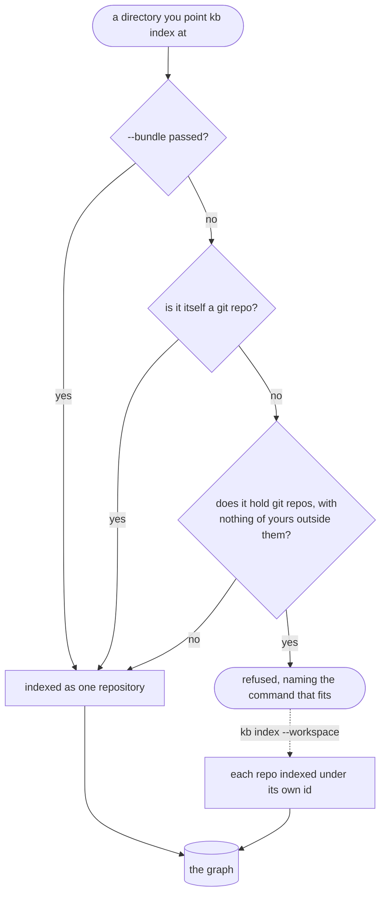

# Index the code graph

Indexing turns your mirrored repos into a queryable knowledge graph. `contextlake kb index --workspace
~/work` walks every git repo under a folder and builds the graph. Runs are incremental by default;
`--force` rebuilds from scratch.

<p align="center">
  
</p>



<div class="dg-key">
  <i><b class="dg-sh-step"></b>a rectangle is something that runs</i>
  <i><b class="dg-sh-store"></b>a cylinder is something that persists</i>
  <i><b class="dg-sh-act"></b>a rounded box is a start or an end point</i>
  <i><b class="dg-sh-dec"></b>a diamond is a decision</i>
</div>

The shape of the directory is measured before any of it is indexed, and the next section walks each
outcome.

## Which command for which directory

`kb index <dir>` indexes that directory as **one** repository. `kb index --workspace <dir>` walks it
and indexes **each** git repository under it separately, under its own identity. Getting those two
the wrong way round is the most expensive mistake available here, so a directory that is not itself a
git repository but holds some is **refused**, with the command that fits what was found:

```
$ contextlake kb index ~/work
✗ /home/you/work isn't itself a git repo, but contains 20 git working tree(s) at depths 1-2
  (alpha, beta, billing-core, frontend, gateway, …); no indexable file lies outside them.
  That is a workspace mirroring several repositories. Indexing it this way files all of them
  under ONE id, so every symbol they hold is in the graph twice and the copies cannot be told apart.
  → Run this instead, which indexes each repository separately under its own identity:
        contextlake kb index --workspace ~/work
  → Or pass --bundle to index this directory as one repository anyway. …
```

It refuses rather than switching to `--workspace` for you, because switching can lose data.

`--workspace` indexes the nested repositories and nothing outside them. So on a tree of your own
loose sources that happens to carry a dependency with its own `.git`, it would index the
dependency and drop your files.

The shape is measured first: how much indexable content lies outside the nested repositories.
Only then does it decide:

| What the directory looks like | What happens |
| --- | --- |
| Several repositories, effectively nothing of your own outside them | refused; run `--workspace <dir>` |
| One repository, nothing at all outside it | refused; the directory is one level too high, and the command names the repository |
| Real content of yours outside the repositories (your sources plus a vendored dependency) | indexed as one repository, with a line saying so |
| A git repository (`.git` present), whatever it contains | indexed, no diagnosis at all |

**`--bundle` opts back in.** It indexes the directory as one repository regardless of shape, and it
is read before anything is measured, so it always works. Reach for it when you genuinely want one
bundled repository -- and note the cost you are accepting: the nested repositories' files are filed
under the directory's name, so if you later index them properly they are in the graph twice. `kb
forget <repo-id>` removes a bundle you did not mean to create.

## Incremental and time-travel

`index --workspace` is **incremental**. It re-indexes only repos whose git HEAD moved since their
last index, so a scheduled run stays cheap.

- `--force` rebuilds everything.
- `--watch [--interval N]` keeps re-indexing in a loop. The same two flags also drive `connect`
  and `embed`.

Every indexed snapshot is kept, which gives you **time travel**:
`query "<text>" --repo R --as-of <commit>` searches repo `R` as it was at a previously indexed
commit.

## Re-indexing one repository by its id

A repository's **id** is derived from its `origin` remote (so it survives being moved or re-cloned) and has
no relation to where the clone sits on disk. That is the id `kb lint` and the dashboard report, so
`--source` accepts it directly:

```bash
contextlake kb index --source example.com/team/widgets   # the id, exactly as reported
contextlake kb index --source widgets                    # the tail, when only one repo ends that way
```

The repository is re-indexed under the id it was already filed as, never a second time under its directory
name. If the id is unknown, the error names near-miss ids from the store; if it is known but its recorded
checkout is gone, the error names the path it was indexed from.

Use `--repo` to set the id explicitly, for a checkout with no usable `origin` or one you want
filed under a different name:

    contextlake kb index --source ./widgets --repo team/widgets

Without it, the id falls back to the directory name. That is exactly the fragile, path-dependent
id this section exists to avoid. Name it once, rather than living with a repo filed as `widgets`
because that is what the folder happened to be called.

## Parallelism and noise-pruning

Repositories are parsed across **worker processes** (CPU-bound work) while the SQLite store is written
serially from the parent. The `spawn` start method is used on every platform, so behaviour is identical on
Linux, macOS, and Windows, with an automatic serial fallback if a worker pool can't start. It defaults to
`cpu_count - 1` workers (capped at 8); set `[kb] index_workers` to tune it (`1` forces serial).

The parser **skips machine-generated and derived files**. It skips a file when any of these
match:

- a name like `*.designer.cs`, `*.min.js` or `AssemblyInfo.cs`
- one of four header markers in the first 2048 bytes, matched case-insensitively:
  `<auto-generated`, `@generated`, `do not edit`, `code generated by`
- a size over `[kb] max_file_bytes`, which defaults to 5 MB

The marker list catches more than it looks. A file whose banner only says "DO NOT EDIT" is
skipped too.

All of that is derived noise rather than real source, and **every skip is reported**, so there
are no silent gaps. To index them anyway, set `[kb] skip_generated = false` or raise
`max_file_bytes`.

### The per-repository memory budget

`max_file_bytes` bounds one FILE. It cannot bound a repository that is wide rather than deep,
and that distinction is not theoretical: one repository in a 660-repo fleet took a 15.4 GB
machine down while its largest single file was 3.57 MB, comfortably under the 5 MB cap. The
cap never fired once. What broke it was 1,432 XML files averaging 0.42 MB, adding up to
671 MB.

`[kb] max_repo_memory` bounds the whole repository, and is checked **before any file is
read** rather than after a shard exists. It defaults to 3 GB. A repository whose estimate
exceeds it is skipped with its name, its estimated cost, and the file kinds that dominate,
and the rest of the run continues.

The estimate weights each file kind by measured cost per byte, because they differ by a lot:

| Kind | Peak memory per byte of source |
| --- | --- |
| code | 19.6x |
| SQL | 5.0x |
| XSD / XSL | 4.3x |
| XML | 3.5x |

Code is six times worse than markup, and the reason is edge count rather than node count: a
sample of 5,738 C# files produced 82,000 nodes and 467,000 edges. So 400 MB of code is far
more expensive than 400 MB of XML, and a budget in raw bytes would refuse the wrong ones.

Two caveats worth knowing before you tune it:

- **The estimate is linear and the real cost is not.** Cross-file reference resolution grows
  with the number of symbols, so the estimate runs low on the largest repositories, which is
  where it matters most. Treat it as a coarse guard, not a prediction. The shard-item guard
  that runs after a shard is built is the second layer.
- **This bounds one repository; a run's peak is this times the worker count.** On a smaller
  machine, lower `max_repo_memory`, `index_workers`, or both.

Set `max_repo_memory = 0` to disable the check.

Discovery also skips **vendored nested repos**: an upstream clone carried inside the mirror,
with its own `.git`, under a `module-federation` path segment. That is not your source, and
indexing it would flood the global graph with upstream demo nodes. Each skip is logged.

`node_modules` trees are pruned before discovery even descends into them.

To exclude your own paths, drop a **`.contextlakeignore`** at a repo's root. One glob per line;
`#` comments and blank lines are ignored.

Each glob is matched against the file's path relative to the repo, and against its name. So:

- `*.lock` ignores by name, anywhere in the repo
- `vendor/` ignores that directory and everything under it

It is a small, dependency-free subset of gitignore syntax. No negation, no `**`, no anchoring.
Enough to drop vendored trees and lockfiles from the graph.

## Health and maintenance

**`contextlake doctor`** checks the environment: FTS5, `git` and `glab` on PATH, the store, the
embedder and the ANN index. It exits non-zero if anything is wrong, so it works as a CI health
gate.

It also flags any shard indexed with an older parser version than the one installed. That flag
is advisory and does not affect the exit code. `contextlake kb index` rebuilds those on its next
run, so they pick up parser fixes.

**`contextlake kb lint`** audits the graph itself. It reports:

- **stale repos**, where HEAD moved since they were indexed
- **dangling edges**, where an edge's endpoint node is missing
- the same **older-parser** repos doctor reports, so the two commands never disagree

Both exit non-zero on problems. For lint that means dangling edges, HEAD-stale repos, or repos
it cannot read.

The older-parser count is reported but deliberately kept out of lint's exit code. Otherwise
upgrading to a build with a new parser could turn a green CI gate red on its own.

Two states are reported apart from stale, because re-indexing clears a stale repository and cannot clear
either of them:

- **empty** -- the repository has no commits at all, so there is no HEAD and nothing to index. Reported,
  and not counted against the exit code: there is nothing for a reader to do about it.
- **shard-imported** -- indexed from a graph-shard JSON rather than a checkout, so it has no history to
  be behind. Also advisory, for the same reason.
- **unreadable** -- the recorded path no longer exists, or git will not answer for a repository there.
  Re-clone it or drop it from the store. This one does fail the run, because nothing can be cited from it.

The full node and edge model, language by language, is in [The code graph model](code-graph-model.md).

## The graph, on this page


<p class="shot-cap">What an index produces. This one is contextlake's own repository, indexed by the commands on this page. It is the shipped visualizer, not a recording, and it runs
offline with no network calls.</p>

## See also

- [Connect and enrich](connecting-and-enriching.md)
- [Semantic search](searching-semantically.md)
- [Serve it to your editor](serving-over-mcp.md)
