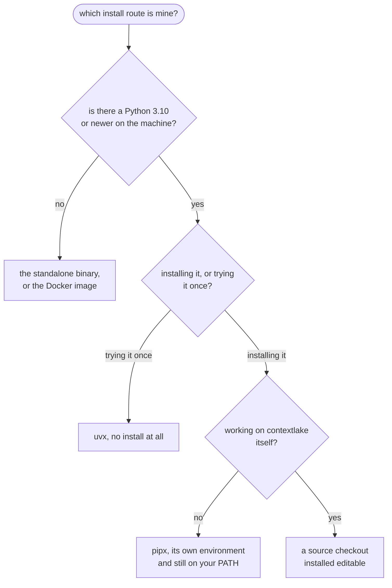

# Install and upgrade

Every way to get contextlake onto a machine, what each channel is good for, and how to
upgrade or remove it later. This is the single source for install commands: other pages
link here rather than repeating them, so there is one place to fix when a command changes.

Pick a channel, run one command, then jump to [Quickstart](../QUICKSTART.md) for your first
real result. Which channel is yours comes down to two or three questions:



<div class="dg-key">
  <i><b class="dg-sh-act"></b>a rounded box is a start or an end point</i>
  <i><b class="dg-sh-step"></b>a rectangle is a channel below</i>
  <i><b class="dg-sh-dec"></b>a diamond is a decision</i>
</div>

`pip` works everywhere `pipx` does and is the answer when you want contextlake inside an
environment you already manage.

## Prerequisites

- **Python 3.10 or newer** for the knowledge layer. The `[kb]` extra depends on the `mcp`
  SDK, which requires 3.10, so that is the floor for anything beyond mirroring
  (`pyproject.toml`, the `kb` extra). The whole tool declares `requires-python = ">=3.10"`
  and runs there happily.
- **`git`** on your PATH.
- **A platform token, only for fleet mirroring**: `GITLAB_TOKEN` (a PAT with `read_api` and
  `read_repository`), or `GITHUB_TOKEN` / `BITBUCKET_TOKEN` / `GITEA_TOKEN`. On GitLab an
  authenticated [`glab`](https://gitlab.com/gitlab-org/cli) works instead. Indexing a repo
  you already have on disk needs no token at all.

None of the channels below need a C or C++ compiler. If an install starts building from source
anyway, it is a tree-sitter grammar with no wheel for your platform, and the remedy is in
[The knowledge layer will not install](troubleshooting.md#the-knowledge-layer-will-not-install).

## Install

<div class="tabs">
<div class="tab" data-label="pipx"><pre><code>pipx install "contextlake[kb-full]"</code></pre></div>
<div class="tab" data-label="pip"><pre><code>pip install "contextlake[kb-full]"</code></pre></div>
<div class="tab" data-label="uv"><pre><code>uv tool install "contextlake[kb-full]"
# or run it once, without installing:
uvx --from "contextlake[kb-full]" contextlake --help</code></pre></div>
<div class="tab" data-label="Docker"><pre><code>docker run -v "$PWD:/work" ghcr.io/sayak-sarkar/contextlake doctor</code></pre></div>
<div class="tab" data-label="Binary"><pre><code># download the asset for your platform from
# https://github.com/sayak-sarkar/contextlake/releases/latest
chmod +x contextlake-linux-x86_64
./contextlake-linux-x86_64 doctor</code></pre></div>
</div>

`pipx` is the recommendation: it gives contextlake its own environment and still puts the
command on your PATH, which is what you want for a tool rather than a library.

`[kb-full]` is the batteries-included bundle. A plain `pip install contextlake` gives you the
mirror only, and it pulls exactly one dependency (`argcomplete`, for shell completion), so it
stays viable on a locked-down machine.

However you install it, `contextlake` and `python -m contextlake` are equivalent entry points.
`python3 run-contextlake.py` is a third one, but it only exists in a source checkout: the wheel
declares a single console script and ships no top-level launcher, so it is not there after a
`pip`, `pipx` or `uv` install.

### The extras, and which one you want

| Extra | Adds | When you need it |
| --- | --- | --- |
| `[kb]` | The knowledge layer: parse to graph to wiki to MCP server | Anything beyond mirroring |
| `[kb-full]` | `[kb]` plus the built-in CPU embedder and the sqlite-vec ANN backend | The default choice: local semantic search with no Ollama and no API key |
| `[kb-vec]` | The sqlite-vec ANN backend | Faster vector search than the pure-Python exact scan |
| `[kb-local]` | The built-in CPU embedder (model2vec, about 30 MB) | Semantic search with no Ollama and no API key |
| `[kb-fastembed]` | A higher-quality ONNX embedder (about 90 MB) | Better semantic ranking, at a larger download |
| `[kb-pdf]` | The PDF text-layer reader for ingest (pypdf, pure Python) | Design docs, RFCs and decision records that arrive as PDFs |
| `[llm-local]` | A built-in CPU model for the wiki (openvino-genai) | `kb wiki --llm builtin` with no Ollama and no API key |

Contributors also have `[dev]` (pytest, ruff, pre-commit) and `[release]`. See
[CONTRIBUTING.md](../CONTRIBUTING.md).

### The built-in wiki LLM is one extra

`[llm-local]` is an ordinary extra. Let contextlake install it into the right interpreter:

```bash
contextlake doctor --fix llm-local     # --dry-run prints the exact command and stops
```

That runs pip in the interpreter contextlake is running in, and prints the command before it
runs it. By hand it is:

```bash
pip install "contextlake[llm-local]"
```

No compiler, no wheel index and no `--only-binary` pin. The standalone binary installs it on
first run, and the full Docker image ships the runtime and the model baked in.

The model itself (~349 MB, Apache-2.0) downloads on first wiki run, not at install time. For
which backend to choose and why, see
[Installing the built-in LLM](model-providers.md#installing-the-built-in-llm).

### Docker

The published image at `ghcr.io/sayak-sarkar/contextlake` carries the knowledge layer plus
the built-in CPU models (the embedder and a small wiki LLM), so it runs with no Ollama, no
API key, and no model download at runtime. Reach for it on locked-down or offline machines;
the PyPI wheel stays the primary install. It runs as a non-root user.

One thing the default image does **not** carry is the `sqlite-vec` ANN backend (`[kb-vec]`): it is
built from `[kb,kb-local,llm-local]`. Semantic search still works there, on the pure-Python exact
scan, which is the slower path on a large store. If that matters more to you than a baked-in wiki
LLM, `:slim` is the tag that ships `kb-vec`.

```bash
docker run -v "$PWD:/work" ghcr.io/sayak-sarkar/contextlake doctor
docker run -v "$PWD:/work" ghcr.io/sayak-sarkar/contextlake kb index
```

The `-v` mount is what makes the run worth doing. Everything contextlake persists, the
knowledge store included, is written under it as `.contextlake/`, so it is still on the host
after the container exits. Drop the `-v` and the run is ephemeral.

That bare `kb index` indexes the mount as one repository, which is right when you mount a
repository. Mount a directory that *holds* repositories and it is refused, telling you to run
`kb index --workspace .` instead -- `.` being the mount, since that is the container's working
directory. See [Which command for which
directory](index-code-graph.md#which-command-for-which-directory).

The container runs as uid 1000, and a bind mount keeps the host's ownership, so if your host
account is not uid 1000 the write fails with a permission error. Pass your own ids:

```bash
docker run -u "$(id -u):$(id -g)" -v "$PWD:/work" ghcr.io/sayak-sarkar/contextlake kb index
```

It fails rather than falling back on purpose. Before 5.1.0 the store was written inside the
container instead, so the run appeared to succeed and the index was gone the moment the
container exited.

A `:slim` tag is also published, built from `[kb,kb-local,kb-vec]`: no `openvino-genai`, no baked
wiki-LLM model, a much smaller pull, and the `sqlite-vec` ANN backend the default image leaves out.
Semantic search still works, because the embedder is pure Python. Point the
wiki tier at Ollama, OpenAI, Anthropic or `cli` instead of the built-in LLM.

```bash
docker run -v "$PWD:/work" ghcr.io/sayak-sarkar/contextlake:slim doctor
```

### The standalone binary

If the machine has no Python at all, the release assets are self-contained launchers built
with [PyApp](https://ofek.dev/pyapp/). The launcher bootstraps a private Python plus
`contextlake[kb-full,llm-local]` into its own cache on first run, which needs network once;
every run after that is instant. Everything it installs comes from an ordinary prebuilt wheel on
PyPI, so there is no compiler to install and nothing for you to pass.

Three assets are published per release, one per build platform:

| Asset | Platform |
| --- | --- |
| `contextlake-linux-x86_64` | Linux, x86-64 |
| `contextlake-macos-arm64` | macOS, Apple silicon |
| `contextlake-windows-x86_64.exe` | Windows, x86-64 |

On Linux and macOS, `chmod +x` the file and run it with `./`. On Windows, run the `.exe`
directly. If your platform is not in that table, for example macOS on Intel or Linux on
arm64, use `pipx` or `uv` instead; there is no binary for it.

#### Checking a download is the one we published

Each launcher is signed at release time with a build provenance attestation, so you can check
a download came from this repository's release workflow and not from somewhere else:

```bash
gh attestation verify contextlake-linux-x86_64 --repo sayak-sarkar/contextlake
```

That needs the `gh` CLI and no key material: the signature is verified against a public
transparency log.

**What it proves, and what it does not.** It proves the file you have is byte-for-byte the
file this repository's workflow built and uploaded. It says nothing about the Python payload,
because the launcher downloads contextlake and its dependencies from PyPI on *your* machine at
first run, which happens after any signature here. If you want the payload checked too, install
with `pipx` or `uv` instead: the wheel and sdist on PyPI carry their own
[PEP 740](https://peps.python.org/pep-0740/) attestations, which pip verifies, and each release
also publishes a CycloneDX SBOM listing that dependency closure.

The SBOM does not close the gap on its own, either. Its subject is `contextlake[kb-full]`, while the
launcher installs `contextlake[kb-full,llm-local]`, so the wiki-LLM runtime and everything under it
is outside what the SBOM enumerates.

### From source

```bash
git clone https://github.com/sayak-sarkar/contextlake && cd contextlake
python -m venv .venv && . .venv/bin/activate
pip install -e ".[kb]"
```

Contributors should use `pip install -e ".[dev,kb]"` and read
[CONTRIBUTING.md](../CONTRIBUTING.md) for the test loop.

## Verification

```bash
contextlake --version
contextlake doctor
```

`--version` should print the version you just installed. `doctor` checks the whole knowledge
layer in one pass (SQLite FTS5, `git` and `glab` on PATH, config, the store's real counts,
the built-in embedder, the ANN index, shard freshness) and prints a line per check.

**Read the output, do not gate on the exit code alone.** `doctor` exits non-zero only when the
environment cannot support a run at all: FTS5 missing, `git` missing, or the config and store
unreadable. Everything else is reported and does not fail the command, including **shard
staleness** and the optional tiers (`glab`, embeddings, the ANN index, the wiki model). That
matches `kb lint`, which deliberately keeps staleness out of its exit code for the same reason:
a stale shard is a thing to act on, not a broken install, and failing a build over one would
make the check unusable on any workspace mid-migration.

The consequence is worth stating plainly, because it is the opposite of what an exit code
usually implies: **a store full of stale shards prints a red mark for each and still exits 0.**
If you want a build to stop on that, parse the output or use `kb lint`'s report, and see the
upgrade section below.

A fresh machine with no store yet is expected to report a missing config as a warning, not a
failure.

If `doctor` names something missing, `contextlake doctor --fix` installs it. That is the next section.

## Installing what is missing

`doctor` reports; `doctor --fix` repairs. With no value it installs only what your **resolved**
configuration actually calls for, so a `[llm]` block that is disabled or set to `ollama` never pulls
the local built-in runtime. Name a capability to install it regardless of config.

| Flag | Effect |
| --- | --- |
| `--fix` | Install every missing dependency the resolved config calls for |
| `--fix <capability>` | Install one: `git`, `embedder`, `vectors`, `llm-local` (`embedder` resolves against your config: `[kb-fastembed]` when `engine = "fastembed"`, `[kb-local]` otherwise) |
| `--dry-run` (`-n`) | Print the full plan, exact commands included, and change nothing |
| `--skip-interactive` | Never prompt: privileged commands are printed, not run |

Two privilege tiers, and the split is deliberate:

- **Python packages** install into the interpreter contextlake is running in, with
  `sys.executable -m pip` (never a bare `pip`, which can belong to another environment). Unprivileged
  and reversible, so `--fix` runs them after printing them.
- **System packages** (currently just `git`) need administrator rights. The exact command is printed
  in full and offered with a **y/N prompt at a real terminal only**. With `--skip-interactive`, or
  when stdin is not a TTY, it is printed and nothing runs, so a CI job or a scripted invocation can
  never trip a sudo prompt.

`--fix` also explains, rather than re-raising, the failures that actually happen: a PEP 668
externally-managed environment (use a venv or pipx), a proxy timeout, an untrusted intercepting CA,
or no matching distribution. Nothing planned is ever run before it has been printed.

`--fix` can still exit non-zero after installing everything it planned, if the diagnostic report also
found a problem `--fix` has no remedy for. The exit code reflects the report, not the installs.

## Upgrade

```bash
pipx upgrade contextlake                       # pipx
pip install --upgrade "contextlake[kb-full]"   # pip
uv tool upgrade contextlake                     # uv
docker pull ghcr.io/sayak-sarkar/contextlake   # image
```

Your store and config carry forward. Confirm with `contextlake --version`, then run
`contextlake doctor`.

`doctor` is load-bearing after an upgrade, not a formality. A release that changes how code
is parsed leaves every existing graph shard describing the old parse, and no repository's
HEAD commit moved, so nothing about the repositories themselves signals it. `doctor` compares
the parser version recorded in each shard against the running one and names the repos that
are out of date (`src/contextlake/kb/cmds/doctor.py`, the "shards up to date with the current
parser" check).

Re-index those with a plain index run -- whichever of the two forms you built the store with:

```bash
contextlake kb index                     # one repository
contextlake kb index --workspace ~/work   # a directory of repositories
```

Since 5.1.0 that is enough. `kb index` re-indexes a repository whose recorded parser version
differs from the running one even though its HEAD has not moved, and says so in the log
(`src/contextlake/kb/cmds/index.py`, the `stale_parser` path). Before 5.1.0 it skipped those
repositories silently and `--force` was the only way through, which is why older instructions
insist on it.

`contextlake kb index --force` still exists and still rebuilds everything unconditionally.
Use it when you want a full rebuild, not because an upgrade requires one.

### Parser version `4` rebuilds every existing store

`PARSER_VERSION` is now `4` (raised in 7.0.0), which means **every store built before that release
reports stale**, under `doctor` and in `kb lint`'s advisory line, and the next `contextlake kb index`
rebuilds all of it. Nothing is broken and nothing needs a flag; it is simply an index run that costs
what your first one did, once, rather than the near-instant no-op an unchanged workspace usually
gets. Budget for it before you run it inside a hook or a CI job on a large mirror.

The bump earns that. Version `4` is the largest output change this stamp has ever covered
(`src/contextlake/kb/parse.py`, the comment above `PARSER_VERSION`):

- node ids became file- and line-independent, so **every id changed**, and a header and its `.cpp`
  finally describe one symbol rather than two;
- config keys, SQL and XML gained file nodes and `contains` edges;
- five symbol kinds are emitted that never existed before: data members, macros, typedefs, enum
  constants and file-scope variables;
- `calls` edges are stored per call site rather than per caller/callee pair;
- C++ internal linkage is honoured in both identity and resolution, so two files' `static` or
  anonymous-namespace symbols stop merging into one.

The catch is that all of it lives in the parser, so it reaches an already-built store only when the
shards are rebuilt. A version bump is exactly the mechanism that makes that happen without asking
you to know it was needed: every change above is invisible to a commit-keyed check, so a graph
carried forward untouched would keep answering with ids this build no longer produces, and every
surface would keep calling it healthy.

## Uninstall

Remove the tool:

```bash
pipx uninstall contextlake                     # or:  pip uninstall contextlake
docker rmi ghcr.io/sayak-sarkar/contextlake    # if you pulled the image
```

That leaves your data in place. contextlake never writes inside your repositories, so
uninstalling it cannot touch your source. To also remove what it created, delete only what
you do not want to keep:

```bash
rm -rf ~/.contextlake        # store, kb.toml, downloaded CPU models, graph/wiki exports
rm -f  ~/.contextlake.ini    # mirror config
rm -rf ~/.cache/contextlake  # the mirror's repository-list cache
# your mirrored repos live in your work_dir (default ~/work); delete only if unwanted:
# rm -rf ~/work
```

`~/.cache/contextlake` is only the default. If `XDG_CACHE_HOME` is set in your shell, the cache is at
`$XDG_CACHE_HOME/contextlake` instead, so remove that path:

```bash
rm -rf "${XDG_CACHE_HOME:-$HOME/.cache}/contextlake"
```

`~/.contextlake` covers the built-in CPU models too: they download to
`~/.contextlake/models` (`DEFAULT_CACHE_DIR` in `src/contextlake/kb/embeddings/builtin.py`
and `src/contextlake/kb/llm/builtin.py`), which is a sibling of the store rather than a
separate cache elsewhere in your home directory.

Two leftovers a package manager cannot remove for you:

- If you accepted the shell-completion offer, a block delimited by
  `# >>> contextlake shell completion >>>` is still in your `~/.bashrc` or `~/.zshrc`, and
  fish users have `~/.config/fish/completions/contextlake.fish`.
- If you used project-local config, `.contextlake.ini` and `.contextlake.kb.toml` are still
  in those project directories.

## Install scenarios

Real setups and the exact command for each.

| Your situation | Command |
| --- | --- |
| "Just mirror my repos, nothing else." | `pipx install contextlake` |
| "Full knowledge layer, zero config." | `pipx install "contextlake[kb-full]"` |
| "Try it once without installing anything." | `uvx --from "contextlake[kb-full]" contextlake kb index --source .` |
| "Upgrade to the latest." | `pipx upgrade contextlake`, or `pip install -U "contextlake[kb-full]"` |
| "No compiler, and a source build just failed." | `pip install -U --only-binary :all: "contextlake[kb-full]"` |
| "I want the built-in wiki LLM, installed with pip." | `contextlake doctor --fix llm-local` |
| "I don't want a local toolchain at all." | The standalone binary, or `docker pull ghcr.io/sayak-sarkar/contextlake` |

The flags worth knowing when you write one of these by hand:

- **`-U` / `--upgrade`** moves an already-installed contextlake to the newest version.
  Without it, pip sees the package installed and does nothing.
- **`--only-binary NAME`** installs that package from a prebuilt wheel only, never building
  from source. On a machine with no compiler it turns a wall of build errors into a clean
  "no matching distribution" message. Name the one native package when you still want a source
  fallback for everything else; `--only-binary :all:` is the blunt version, for the row above where
  a build has already failed and you do not know which package broke. `doctor --fix` always scopes
  to a single package and never uses `:all:`, because forbidding a source fallback everywhere lets
  one missing wheel anywhere fail the whole install.

## See also

- [Quickstart](../QUICKSTART.md), your first indexed repo and a wired editor
- [Troubleshooting](troubleshooting.md), when an install does not go to plan
- [Model providers](model-providers.md), choosing an embeddings and wiki backend
- [Configuration](configuration.md), where settings live and which one wins
