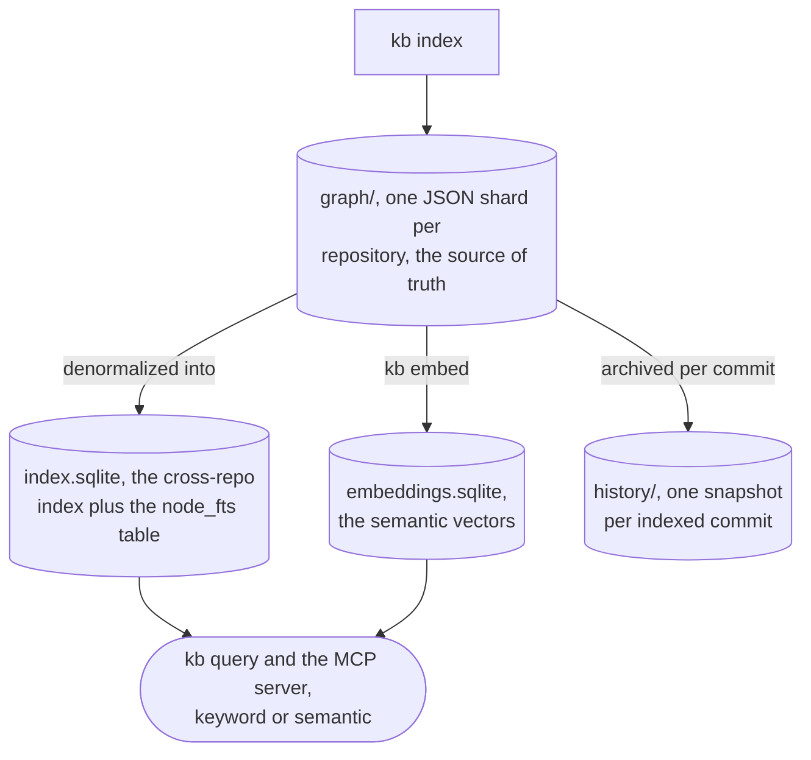

# Architecture and internals

How contextlake works inside: the three tiers and what each is allowed to depend on, how the mirror
picks branches and authenticates, how the knowledge store is laid out and versioned, what is on
disk and what deliberately is not, and the two invariants that keep it out of your repositories.

This is the implementation-depth companion to [contextlake, explained](explained.md), which covers
the same machinery at reasoning depth. Where the two disagree, this page is the one that names
files.

## Three tiers, depending downward only

| Tier | Package | Depends on |
| --- | --- | --- |
| Mirror core | `contextlake` | The Python standard library, plus `argcomplete`, plus the external `git` and `glab` binaries |
| Knowledge layer | `contextlake.kb`, the `[kb]` extra | The mirror core, tree-sitter grammars, pydantic, the `mcp` SDK |
| Serving | `kb/server.py`, `kb/dashboard/`, `kb graph` | The knowledge layer, read-only |

The mirror core declares exactly one pip dependency (`pyproject.toml`), which is the constraint that
keeps `pip install contextlake` viable on a locked-down machine. The knowledge layer is imported
lazily from the CLI, so the core runs with the extra absent and says so if you reach for a `kb`
verb without it. `[kb]` needs Python 3.10 or newer because the `mcp` SDK does; the core declares
`requires-python = ">=3.10"`, one floor shared by both tiers.

## Configuration

Two config systems, one per tier, both merging the same way: built-in defaults, then a global file,
then the nearest ancestor directory's local file, then an explicit `--config`, then CLI flags.

| Tier | Global | Directory-scoped | Constant |
| --- | --- | --- | --- |
| Mirror | `~/.contextlake.ini` | `.contextlake.ini` | `CONFIG_FILE`, `LOCAL_CONFIG_FILE` in `src/contextlake/config.py` |
| Knowledge | `~/.contextlake/kb.toml` | `.contextlake.kb.toml` | `GLOBAL_CONFIG`, `LOCAL_CONFIG` in `src/contextlake/kb/config.py` |

Discovery walks up from the current directory to the filesystem root, the way git finds `.git`.

<p align="center">
  
</p>

One carve-out matters for safety. Settings that would cause contextlake to *run a program* are
honoured only from a file you named explicitly or from your own home config, never from a file found
by the directory walk, because such a file can arrive inside a repository you cloned. The gate is on
provenance rather than content, so a project-local `store_dir`, `languages` or `[[rules]]` keeps
working (`src/contextlake/kb/trust.py`). The full settings tables are on
[Configuration](configuration.md).

## The mirror layer

### Discovering repositories

`mirror fetch` enumerates every project the account can see on the configured group, drops archived
ones, and caches the result in two files under `<cache_dir>`:

| File | Shape | Used for |
| --- | --- | --- |
| `gitlab_projects.json` | The full API response | Inspection and debugging |
| `gitlab_projects.txt` | `path_with_namespace\|ssh_url\|http_url\|default_branch\|archived` | The primary data source for every other command |

`cache_dir` defaults to `~/.cache/contextlake` (`$XDG_CACHE_HOME/contextlake` when that is set), in
a per-workspace subdirectory keyed on the workspace path, platform and group, created `0700`
(`src/contextlake/config.py`). Two workspaces therefore never share one cache file. A `cache_dir`
you configure yourself is used verbatim, without a subdirectory, and is created but never
re-permissioned.

That file lists every repository your account can enumerate along with its clone URLs, which is why
its location is treated as a privacy decision. `/tmp` was the old default and was rejected on three
recorded grounds: it is outside your home, so no HOME-based isolation reaches it; it is
world-readable on a shared host; and its path is predictable enough for another user to pre-create
a file or a symlink there.

### Local paths mirror the namespace tree

`to_local_path` in `src/contextlake/core.py` strips the configured group prefix, so the local tree
reproduces everything below the group:

```text
Remote path: acme/backend/services/api-gateway
Local path:  backend/services/api-gateway
```

A path outside the configured group is returned unchanged.

### Concurrency

Everything in the mirror layer is `ThreadPoolExecutor`, because the work is subprocess-bound rather
than CPU-bound. `max_workers` defaults to `8` for cloning, updating and branch switching.

Cloning is the one stage with an adaptive pool. It processes in waves and resizes between them,
stepping the worker count down by one toward `min_workers` (default `2`) when the observed error
rate exceeds `error_threshold` (default `0.5`), and back up when it falls below half of it. The
window is 10 results, so it does nothing at all until 10 clones have been recorded
(`AdaptiveWorkerPool` in `src/contextlake/core.py`). Set `adaptive_workers = false` for a flat pool.

Every subprocess call carries an explicit timeout: `clone_timeout` 300s, `fetch_timeout` 60s,
`pull_timeout` 60s, `branch_timeout` 30s (`DEFAULT_CONFIG` in `src/contextlake/config.py`). A repo
that fails does not stop the run; it is counted, reported, and reflected in the exit code.

### How the most active branch is chosen

`_collect_branch_info` reads every remote branch with
`git for-each-ref --sort=-committerdate refs/remotes/origin/`, dropping `origin/HEAD` by exact
match, then counts commits per branch with `git rev-list --count origin/<branch>`.
`select_most_active_branch` scores them per `branch_strategy`:

| Strategy | Score |
| --- | --- |
| `commits` | Highest commit count. The original behaviour |
| `recency` | Most recent commit |
| `hybrid` (default) | `0.6 * normalized(count) + 0.4 * normalized(recency)` |

Normalization is min-max **across that repository's own branches**, not against any absolute scale,
so the weights compare a branch to its siblings. There is no time window: the count is every commit
on the branch, and the timestamp is the branch tip's commit date.

Two edge cases worth knowing. When every candidate shares a count and a timestamp the normalizer
returns `1.0` for all of them, so the winner is the first in iteration order, which is the most
recently committed branch. And when the upstream branch a repo is on disappears, the same selection
runs again to pick a replacement rather than leaving the clone stranded.

Branch switching is skipped entirely for a repository on a working branch, see
[Branch safety](usage.md#branch-safety).

### Authenticating a refresh

Cloning, `update`'s fetch and both of `branches`' fetches run with an authenticated child
environment when a token is available. The token is read from the environment variable named by
`gitlab_token_env` or `token_env`, defaulting per platform:

| Platform | Token variable | Clone user |
| --- | --- | --- |
| GitLab | `GITLAB_TOKEN` | `oauth2` |
| GitHub | `GITHUB_TOKEN` | `x-access-token` |
| Bitbucket | `BITBUCKET_TOKEN` | `x-token-auth` |
| Gitea | `GITEA_TOKEN` | `oauth2` |

The token value itself is only ever read from the environment; the config file names the variable,
never the secret. It reaches git as an `http.extraHeader` passed through `GIT_CONFIG_KEY_*` /
`GIT_CONFIG_VALUE_*` in the child environment, offset past any `GIT_CONFIG_*` entries you already
set. That is deliberate on two counts, both recorded in `src/contextlake/core.py`: it never appears
on the command line, where `ps` would show it, and it never appears in the clone URL, where git
would persist it into `.git/config`.

Without a token, cloning falls back to `glab repo clone` when `glab` is installed, else plain
`git clone` over HTTPS. Force one path with `clone_method = git` or `glab`.

## The knowledge layer

### Shards are the source of truth, SQLite is the index

Each repository's parse result is written as a self-contained JSON shard at
`<store_dir>/graph/<repo_id>.json`, the repo namespace nesting as directories. `index.sqlite` is a
denormalized cross-repo index built from those shards, and it can be dropped and rebuilt at any
time (`src/contextlake/kb/store/sqlite_store.py`). The reason for the split is recorded in
`src/contextlake/kb/store/shards.py`: a shard is self-contained, so one repository can be
re-indexed in isolation, and shards stay small rather than hitting the size ceiling a single global
graph would.

Shard files also exist for synthetic partitions, which is how non-code content stays separable from
code: `@ingest:<name>`, `@enrich:<repo>`, `@connect:<repo>` and `@wiki`. A re-run of one of those
stages cleanly replaces its own partition without touching the code shard. Keep these distinct from
the **sentinel repo ids** `(shared)`, `(packages)`, `(external)` and `(system)`, which are
attribution values on nodes *inside* real shards rather than shard files of their own.

Every shard is also snapshotted per indexed commit under `<store_dir>/history/<repo_id>/`, which is
what `kb query --as-of <commit>` reads.

The tiers, and which of them you can delete without losing anything:



<div class="dg-key">
  <i><b class="dg-sh-step"></b>a rectangle is something that runs</i>
  <i><b class="dg-sh-store"></b>a cylinder is something that persists</i>
  <i><b class="dg-sh-act"></b>a rounded box is a start or an end point</i>
</div>

`index.sqlite` and `embeddings.sqlite` are both derived: `embed_repo` reads the shard rather than
the index (`src/contextlake/kb/embeddings/index.py`), so an index run and an embed run put either
one back. The shards and their snapshots are the tier a re-parse is the only way to recover.

> [!NOTE]
> A snapshot overwrites identically only for the same commit, by the same parser version, on the
> same machine. File nodes are emitted in `os.walk` order, which is filesystem-dependent, so shard
> bytes are a sound answer to "did this local store change" and are not a basis for comparing
> hashes between machines or CI runners (`src/contextlake/kb/store/shards.py` says so in
> `archive_shard`'s docstring).

### The index schema

Five tables plus a full-text virtual table:

| Table | Holds |
| --- | --- |
| `kb_meta` | Key/value bookkeeping, including the schema stamp |
| `repos` | One row per indexed repository: path, host, default branch, head commit, index time, language stats, parser version |
| `nodes` | Every symbol: id, repo, kind, name, qualified name, file, line start, line end, language, attrs |
| `edges` | Every relationship: src, dst, relation, confidence, context, the three provenance columns, weight, a cross-repo flag, attrs |
| `external` | Declared, and currently unused. Connector content lands as ordinary nodes and edges in the synthetic partitions above |
| `node_fts` | An FTS5 virtual table over node name, qualified name and file |

Five indexes: `edges.src`, `edges.dst`, `edges.cross_repo`, `nodes.repo_id` and `nodes.kind`. Those
are exactly the columns a traversal filters on, which is to say "what does this call", "what calls
this", and "what crosses a repository boundary".

Migrations are additive only, by `ALTER TABLE ... ADD COLUMN`, so an older store opens without a
rebuild.

### Three version numbers, three different questions

| Constant | Where | Answers |
| --- | --- | --- |
| `PARSER_VERSION` | `src/contextlake/kb/parse.py` | "Would today's parser produce a different graph for this repo?" |
| `SCHEMA_VERSION` | `src/contextlake/kb/store/sqlite_store.py` | "Can this build read this index?" |
| `SCHEMA_VERSION` | `src/contextlake/kb/embeddings/store.py` | The same question for the vector store |

They are independent lineages; do not read one as the other. The schema stamp is read before it is
written, so an index written by a newer build is never silently stamped down to an older number,
and a stamp that is present but unparsable is left alone rather than normalised away so that it can
be reported.

### How staleness is decided

Two separate questions, asked separately on purpose.

- **`needs_reindex` is HEAD-only.** It compares the repository's current git HEAD against the
  commit recorded for it. That is cheap and it is the common case.
- **`indexed_parser_version` asks the other question**, resolving through the `repos.parser_version`
  column, then a cheap peek at the head of the shard file, then a full shard read. An unknown answer
  counts as stale.

`kb index` uses both, short-circuited: a repository whose HEAD moved is queued without consulting
the parser version at all, and only the otherwise-unchanged repositories are checked for a parser
mismatch. Those are re-indexed rather than merely reported, and the run announces how many and from
which version. The comment in `src/contextlake/kb/cmds/index.py` gives the reasoning: a repo at the
same commit indexed by an older parser holds a graph this build would not produce, and the
alternative is "a green 'unchanged' over a stale graph, and no amount of wording makes that safe".

`kb lint` reports the same repositories but deliberately keeps them out of its exit code, on the
grounds that such a graph is out of date rather than broken, and a version bump should not turn
every CI gate red on its own. `doctor` reports it as advisory for the same reason. All three read
the same signal, so they cannot disagree about one store.

### Parallel parsing, serial writes

`kb index` parses repositories across a **process** pool (the work is CPU-bound) and persists from
the parent process serially, because SQLite must be written from one place. The `spawn` start method
is used on every platform so behaviour is identical on Linux, macOS and Windows, with an automatic
serial fallback if the pool cannot start. Workers default to `min(8, cpu_count - 1)`; set
`[kb] index_workers` to tune it, or `1` to force serial.

### Locking and connections

An advisory single-writer lock lives at `<store_dir>/.contextlake.lock` and carries the holder's
pid, command, host and start time. A second process on the same host is refused by name rather than
allowed to interleave SQLite writes; a lock left by a dead process is reclaimed automatically;
`CONTEXTLAKE_ALLOW_CONCURRENT=1` overrides it and is rarely correct.

Today `kb index`, `kb embed`, `kb wiki` and the dashboard's mutating routes take that lock; the
dashboard holds it for the one mutation only, never for the server's lifetime, and answers `409` with
the current holder's details if something else has it. `connect`, `ingest` and `enrich` write without
it.

SQLite runs in WAL mode with **one connection per thread**, not one per store. That is forced by
serving: the MCP SDK dispatches every synchronous tool call through a worker thread pool with no
opt-out, so a store that outlives a single call cannot hand the same connection to every thread.

## What is on disk

Everything contextlake generates lives under one store directory, `~/.contextlake/kb` by default
(`DEFAULT_STORE_DIR` in `src/contextlake/kb/config.py`), overridable with `store_dir` in `kb.toml`.

| Path under `store_dir` | Contents |
| --- | --- |
| `index.sqlite` | The cross-repo graph and FTS index |
| `graph/<repo_id>.json` | Per-repo graph shards, the source of truth |
| `history/<repo_id>/<commit>.json` | Bitemporal snapshots, one per indexed commit |
| `embeddings.sqlite` | Semantic vectors, once `kb embed` has run |
| `wiki/` | Generated wiki pages, including `wiki/_modules/` for per-subsystem pages |
| `graphs/` | Rendered visualizations from `kb graph`, including the `--site` export |
| `dashboard/` | The dashboard's site export and its pid and log files |
| `.contextlake.lock` | The advisory single-writer lock |

### What lives outside the store, and why

Four things do not, so "delete the store" is not the same as "delete everything":

- **Downloaded CPU models**, at `~/.contextlake/models` (`DEFAULT_CACHE_DIR` in
  `src/contextlake/kb/embeddings/builtin.py` and `src/contextlake/kb/llm/builtin.py`). That is a
  *sibling* of the default store, not a directory inside it, so a store pointed elsewhere does not
  move the models. Both also set `HF_HOME` to that directory unless you already set it.
- **The mirror's repository-list cache**, under `cache_dir` as described above.
- **The mirror audit report**, written next to that cache as `repo_audit.json` and a matching
  `.csv`, or wherever `--report` points.
- **Shell completion**, which is a delimited block in `~/.bashrc` or `~/.zshrc`, or a file at
  `~/.config/fish/completions/contextlake.fish`, plus a marker at
  `~/.contextlake/.completion_setup_done` recording your decision. Only written when an interactive
  run offered it and you accepted, or when you passed `--completion`.

`kb steer` is the fifth and is a deliberate carve-out rather than an exception to fix: it writes
`AGENTS.md`, `CLAUDE.md`, `.windsurfrules`, `.kiro/steering/`, `.mcp.json`, `.vscode/mcp.json` and a
skills library into the directory you point `--out` at, defaulting to the current one, because an
editor has to find those at the workspace root it opens. `bootstrap` steers the mirror root, which
is not itself a repository.

## The two invariants

### INV-1: generated files never land inside a mirrored repo

> [!IMPORTANT]
> No contextlake-generated file is ever written inside a mirrored repository's working tree.

The mirror holds your repositories untouched; everything built from them lives under the separate
store. `tests/kb/test_no_repo_pollution.py` enforces it by hashing every file in two temporary git
repositories, driving four verbs over them (`kb index --workspace`, `kb graph --overview`,
`kb query`, and `kb steer --out` at the mirror root), and asserting both trees are byte-identical
afterwards. It also asserts the store materialised outside the mirror.

Four verbs, not all of them: `wiki`, `embed`, `connect`, `ingest`, `enrich` and `dashboard` are not
exercised by that test today.

### INV-2: the offline boundary

> [!IMPORTANT]
> Parsing, the graph, FTS, query, visualization and embedding all run with no network. The
> connectors are the opt-in exception, and even they degrade rather than fail.

`tests/kb/test_offline_boundary.py` enforces it by patching `socket.getaddrinfo` and
`socket.create_connection` to raise, then asserting that `kb index`, `kb query`, `kb graph
--overview`, `kb lint`, `kb embed`, `kb connect` and `kb dashboard --site` all still succeed.
`connect` in particular must skip and warn rather than crash, which is what makes running in an
egress-restricted environment safe.

Two honest limits on that guarantee. The test patches those two socket entry points rather than all
of them, so a raw socket to a literal IP address would not be caught. And `wiki`, `ingest`,
`enrich`, `serve` and `steer` are not exercised offline by it.

The built-in embedding model is fetched once and cached, after which embedding is offline too.
Connector results, once fetched, stay queryable offline.

## See also

- [contextlake, explained](explained.md), the same decisions at reasoning depth
- [Index the code graph](index-code-graph.md), what the parser actually extracts
- [Configuration](configuration.md), the full settings reference
- [Mirror repositories](usage.md), the commands this layer implements
- [`contextlake` command reference](cli-reference.md), every flag
