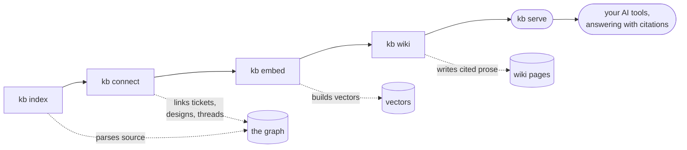

# Knowledge layer

An optional subsystem (`contextlake.kb`) turns your mirrored repositories into a queryable **knowledge
graph** and serves it to AI agents over **MCP**, so an assistant can ask "where is `X` defined?", "who
calls `Y`?", or "which repos depend on package `Z`?" instead of grepping hundreds of repos. It's generic:
it indexes *any* repositories and connects to *any* configured knowledge sources; no deployment-specific
data lives in the package (your sites, keys, and rules go in a private config file).

This page orients you; each stage below has its own focused page.



<div class="dg-key">
  <i><b class="dg-sh-step"></b>a rectangle is something that runs</i>
  <i><b class="dg-sh-store"></b>a cylinder is something that persists</i>
  <i><b class="dg-sh-act"></b>a rounded box is a start or an end point</i>
</div>

Each stage adds to the same store, and you can stop after any of them. Run the whole chain with one
command using [`bootstrap`](keeping-it-fresh.md), or work through it stage by stage below.

## Install the extra

The knowledge layer needs the `[kb]` extra (Python 3.10 or newer), or `[kb-full]` if you
also want local semantic search with no Ollama and no API key. See
[Install and upgrade](installing.md) for every channel and the full extras table.

```bash
pip install "contextlake[kb-full]"
contextlake doctor                   # check the environment
```

`contextlake doctor` verifies the whole layer in one pass (FTS5, `git` / `glab` on PATH, the store's real
counts, the built-in CPU embedder, and the ANN index) and exits non-zero if anything is wrong, so it
doubles as a CI health gate:

<p align="center">
  
</p>

The fastest way to build all of it is one command, `contextlake bootstrap` (see
[Bootstrap and keep it fresh](keeping-it-fresh.md)). The rest of this section is the map of what that pipeline does,
stage by stage.

## Building it, stage by stage

- **[Index the code graph](indexing-the-code-graph.md)**: parse your repos into a typed graph of files, symbols,
  call/inheritance edges, infrastructure, SQL, and web topology.
- **[Connect and enrich](connecting-and-enriching.md)**: link repos to their issues, docs, and designs, ingest
  external documents, and pull grounded external facts in.
- **[Semantic search](searching-semantically.md)**: embed the graph for natural-language and hybrid retrieval,
  and measure retrieval quality with `eval`.
- **[Generate the wiki](generating-the-wiki.md)**: turn the graph into grounded, council-verified prose per repo
  (and per namespace).
- **[Model providers](model-providers.md)**: choose the embeddings and wiki backend (built-in CPU, Ollama,
  OpenAI, Anthropic, or an agent CLI).
- **[Bootstrap and keep it fresh](keeping-it-fresh.md)**: run the whole pipeline in one command and keep it current.

## Using what you built

- **[Serve it to your editor](serving-over-mcp.md)**: expose the graph over MCP so agents query it directly.
- **[The dashboard](using-the-dashboard.md)**: a local, offline-first UI over the whole knowledge system.
- **[Visualize the graph](visualizing-the-graph.md)**: bounded interactive graph slices and the C4 diagram.
- **[Ask the graph](asking-the-graph.md)**: query it, trace what a change would break, and find who owns it.

For the command list see the [`contextlake` command reference](cli-reference.md); to decode a run see
[Reading the console output](console-output.md).

## See also

- [Indexing the code graph](indexing-the-code-graph.md)
- [The code graph model](code-graph-model.md)
- [Searching semantically](searching-semantically.md)
- [Architecture and internals](internals.md)
