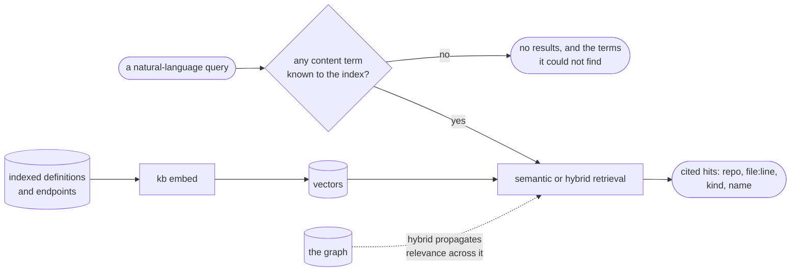

# Semantic search

Semantic search (optional) adds natural-language retrieval on top of the graph, so you can find code by
what it does even when you don't know its name. Set `enabled = true` under `[embeddings]` in the config,
run `contextlake kb embed` to vectorize the indexed nodes into a local store, and `serve` then exposes two
retrieval tools:

- **`semantic_search`** for queries where the exact symbol name is unknown.
- **`hybrid_search`**, which seeds Personalized PageRank with the embedding hits and propagates relevance
  across the graph (HippoRAG-style) to surface structurally related nodes, a function's callers, a
  package's dependents, that a pure semantic match would miss.



<div class="dg-key">
  <i><b class="dg-sh-step"></b>a rectangle is something that runs</i>
  <i><b class="dg-sh-store"></b>a cylinder is something that persists</i>
  <i><b class="dg-sh-act"></b>a rounded box is a start or an end point</i>
  <i><b class="dg-sh-dec"></b>a diamond is a decision</i>
</div>

`--retriever fts` is the third path: keyword-only, so it reads no vectors and needs no floor of its own.

**Where the vectors come from.** `provider` defaults to `auto`, which uses a local Ollama when the daemon
is reachable *and* already has the configured model pulled, and otherwise the built-in CPU embedder (the
`kb-local` extra). If neither is available it embeds nothing rather than reaching for a network service.
Both of those run on your machine, so on the defaults your code never leaves it; name `provider =
"openai"` explicitly if you want a hosted model instead.

## Backends and tuning

The vector store uses an exact pure-Python cosine scan by default; install the optional ANN backend with
`pip install "contextlake[kb-vec]"` (sqlite-vec) for larger workspaces. Three `[embeddings]` keys tune it:

- **`vector_backend`** (default `auto`) picks `sqlite-vec` when that extra is installed and falls back to
  the pure-Python `brute` scan otherwise; force one with `vector_backend = "sqlite-vec"` or `"brute"`.
- **`vector_chunk_size`** (the sqlite-vec `vec0` KNN chunk size, default 1024; clamped to a multiple of 8)
  is applied when the vector store is first created, so re-embed from scratch to change an existing store.
- **`batch_size`** (default `64`) sets how many nodes are embedded per batch.

## What gets embedded

The code **definitions** (classes, functions, methods, interfaces, structs, enums) and HTTP endpoints,
each with its name, qualified name, file path, and captured **signature and docstring**, so a
natural-language query like *"refund a payment to the original card"* finds the right function even when
its name says nothing of the sort. A name alone is thin signal for a natural-language query; the signature
and the docstring are where the words the query actually uses tend to live. File, module, and package nodes are
deliberately not embedded: a path or a shared package name is low semantic signal, and skipping them keeps
results clean and avoids re-embedding cross-repo shared nodes once per referencing repo.

## Which model?

The default is `minishlab/potion-base-8M`, a **static** embedding model: it looks each token up in a
table instead of running a transformer forward pass, which is why it is small enough to ship as a CPU
default and fast enough that query latency is not the thing you notice. `minishlab/potion-base-32M` is
the larger sibling of the same family, one config line away: `model = "minishlab/potion-base-32M"` under
`[embeddings]` (on a fresh vector store, the identity guard refuses to mix models). The `kb-fastembed`
extra plus `engine = "fastembed"` swaps the static model for an ONNX transformer (`bge-small`) instead.

Which one is better **on your code** is a question with a local answer, and
[`kb eval`](#measuring-retrieval-quality) is how to get it: build a golden set from queries your team
actually types, embed with one model, score, re-embed with the other, score again. No published ranking
of these models against somebody else's corpus is worth as much as that run.

Like `index`, `embed` is **incremental**: it re-embeds only repos whose indexed HEAD moved since they were
last embedded, so a scheduled refresh over a large fleet stays cheap. Pass `--force` to re-embed
everything. When an upgrade changes the embedded text format itself, `embed` detects the stale store and
re-embeds everything once, announcing why, then incremental behavior resumes.

A single query returns cited hits (`repo · file:line · kind · name`) that span repos *and* languages, here
the C# and Python payment paths together. `--retriever fts|semantic|hybrid` picks keyword, vector, or
graph-propagation ranking:

<p align="center">
  
</p>

### When the query has no anchor

A vector index has no concept of "no match": it returns its k nearest however far away they are, and every
one of them is a real node with a real file and line, so an answer about nothing you asked reads as cited
and checkable. `--retriever semantic|hybrid` therefore refuses a query when **not one** of its content
terms appears anywhere in the index, and names the terms it could not find:

```
No matches for 'SamlAssertionValidator': nothing indexed matches 'SamlAssertionValidator'.
  No results are shown rather than the nearest k, which would all be real nodes and none of
  them about this query. Index the repo that should answer it, or retry with a term the graph knows.
```

One indexed term anywhere in the query is enough to let the hits through, so ordinary multi-word questions
are unaffected. The exit code stays 0: "nothing in here is about that" is a valid answer. The
`semantic_search` and `hybrid_search` MCP tools apply the same rule over the same store, and return an
empty list rather than prose. With `[embeddings]` off the query degrades to keyword search instead, which
has its own notion of "no match" and needs no floor.

## Measuring retrieval quality

`contextlake kb eval` keeps retrieval falsifiable. Point it at a **golden-query JSON file**, each entry pairs
a query with the node ids it should return:

```json
{
  "queries": [
    {"query": "CatalogService", "expected": ["demo_app_catalogservice"]},
    {"query": "charge", "expected": ["charge"], "match": "name", "kind": "function"}
  ]
}
```

Then `contextlake kb eval --golden queries.json` reports **precision@k / recall@k / MRR** plus a **cost**
dimension (estimated tokens per query, and precision per 1k tokens), so "route to the cheapest sufficient
source" becomes a number, not a vibe. Score any retriever with `--retriever fts|semantic|hybrid`
(semantic/hybrid need embeddings built); a change like embed-bodies or a reranker is then judged by
whether the numbers move.

## See also

- [Index the code graph](index-code-graph.md)
- [Connect and enrich](connect-enrich.md)
- [Serve it to your editor](serve.md)
