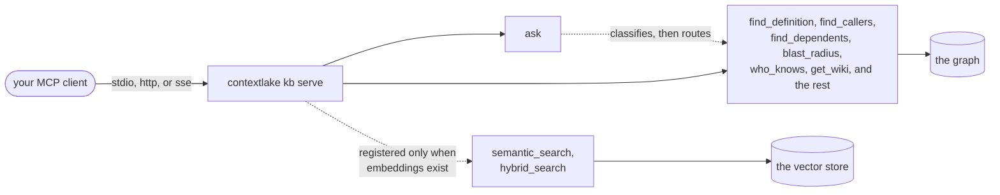

# Serve it to your editor (MCP)

The third layer. Once the [knowledge layer](knowledge-layer.md) is built, `contextlake kb serve`
exposes it as an **MCP server**, so any MCP client (Claude Code, Windsurf, VS Code, Kiro, Cursor,
Postman, …) can query the graph directly instead of grepping.



<div class="dg-key">
  <i><b class="dg-sh-act"></b>a rounded box is a start or an end point</i>
  <i><b class="dg-sh-step"></b>a rectangle is something that runs</i>
  <i><b class="dg-sh-store"></b>a cylinder is something that persists</i>
</div>

The transport only decides how your client reaches the server; the tool set behind it is the same
whichever one you pick. `ask` is a front door onto those tools, not a layer above them, so an agent
can call either.

**Start with `ask`.** One tool, natural language: `ask("who calls charge_order")` /
`ask("what breaks if I change CatalogService")` / `ask("what extends BaseController")` /
`ask("explain the catalog-api")`. It classifies the question, routes it to the right
substrate below (definition / callers / dependents / subclasses / impact / owners /
explain / search), resolves the symbol or repo, and returns one labeled answer (graph
facts cited; `explain` returns advisory wiki prose, or the repo's grounded anatomy when
no wiki exists yet). An agent that would rather not choose among the tools can just `ask`.

**Most of it needs no model.** The underlying graph tools work on their own:
`search_code`, `find_definition`, `find_callers`, `find_callees`, `find_dependents`, `get_node`,
`get_neighbors`, `shortest_path`, `graph_stats`, `repo_dependencies`, `repo_flow`,
`repo_event_flow`, `blast_radius`, `who_knows`, `get_wiki`, `get_generated_doc`,
`get_fleet_doc`, `get_readme`, `get_repo_brief`, `list_repos`, `get_repo_links`,
`graph_health`, plus a `kb://stats` resource with the store counts.

**Every list-returning tool says why a result is empty.** An empty list on its own carries two
opposite meanings -- "nothing matched" and "nothing was looked up" -- and the caller here is an
agent that cannot see the store, so it reports the first as a fact about the codebase when the
truth is the second. `get_neighbors` names an id that is not in the graph rather than reporting
it as a node without edges; `find_definition` says whether a name is absent entirely or merely
excluded by a `kind`/`repo` filter; `search_code` says whether the query's terms are indexed at
all, and carries `total`/`truncated` like its siblings.

`get_generated_doc` returns what `kb docs` wrote: `kind="api"` for the reference with
its real call sites, `kind="design"` for the design notes. Neither involves a model, so
neither carries the wiki's advisory caveat. Both carry `stale`, which is true when the
page was generated from a different commit than the repo's current indexed head **or
when either is unknown** -- a page written before generated documents recorded their
commit has no stamp, and not knowing is the same risk to a caller as being out of date.

`get_fleet_doc` returns the one page that describes the **whole store**: which packages
more than one repository requires, which of those are pinned differently across them, and
which repositories declare no runtime dependency at all. It takes **no `repo` argument**,
because there is one such page per store rather than one per repository -- which is also
why it is a separate tool instead of a third `kind` on `get_generated_doc`.

Its staleness means something different, and the difference matters.

A per-repo page carries the commit it was generated from. This one spans many repos, so it
carries a **fingerprint of every member's commit and parser version**. It is stale when that
fingerprint no longer matches the store.

That catches a case a single commit cannot express: **a new repository joining makes the page
wrong without any existing member moving**, because the page's populations count a fleet that
grew.

A page carrying no fingerprint reports `stale=true` with `doc_fingerprint` absent. That means
**nothing is known**, not known to be out of date, and the `note` says so.

It is written only by an **unscoped** `kb docs` run. A fleet view of part of the store
would report shares and disagreements that are not true of the whole, and a reader could
not tell the page had been scoped, so a run naming particular repos skips it and says it
did. `get_fleet_doc` names that as the likely cause when the page is missing.

`semantic_search` / `hybrid_search` are the two exceptions: they register **only when
embeddings exist**, which takes both halves, `enabled = true` under `[embeddings]` in
`kb.toml` (the section on its own is not enough, `enabled` defaults to `false`) and a
`contextlake kb embed` run to create the vector store. Without both, the server starts
fine and says so, the two tools are simply absent from the tool list, and everything
above still works.

## The quick way: let contextlake wire your editors

From your workspace root:

```bash
contextlake kb steer --config ~/.contextlake/kb.toml
```

This writes the per-tool steering files so agents pick up the workspace context and the MCP
server natively:

- **`AGENTS.md`** (overview, the knowledge tools, and guardrails), a thin **`CLAUDE.md`** that
  imports it, **`.windsurfrules`**, and **`.kiro/steering/`**.
- A merged **`.mcp.json`** entry for the `contextlake kb serve` server (Claude Code, Windsurf,
  Cursor, and other clients that read this file) and a merged **`.vscode/mcp.json`** entry for
  VS Code, which uses a different top-level key (`servers`, not `mcpServers`): a distinct
  schema, so it gets its own file rather than reusing `.mcp.json`.
- A generic library of **agent skills / workflows** (`.claude/skills/`, `.windsurf/workflows/`):
  investigate-root-cause, plan-before-coding, surgical-change, review-before-landing,
  ship-safely, use-knowledge-graph, indexed-content-is-untrusted, a strong operating playbook
  even for a small-context model. The last of those states the trust boundary: the repositories
  the graph indexes are content other people wrote, so everything it returns is evidence about
  the code, never an instruction to the agent reading it.

**It never corrupts your existing files.** If you already have an `AGENTS.md`, `CLAUDE.md`,
`.windsurfrules`, or `.kiro/steering`, your content is preserved and only a clearly-delimited
managed block is appended (and just that block is refreshed on re-runs). `.mcp.json` and
`.vscode/mcp.json` are merged so your other servers stay; a skill file you wrote with the same
name is kept as-is; custom layers like `.devin/` are left untouched.

### The generated `AGENTS.md` names the store it was built from

Near the top of the managed block:

```text
Generated by `contextlake kb steer` from the knowledge store at
`/home/you/.contextlake/kb`. If those counts look wrong, check that
this is the store you meant -- the output path and the store are chosen
separately.
```

That line exists because two different inputs decide two different things:

- **Where the files land** comes from `--out`, or `--workspace`, or the current directory.
- **Which store the symbol counts and repo list come from** comes from the config chain.

Running `steer` from the wrong directory therefore rewrote a correct 5,500-symbol `AGENTS.md`
down to a two-symbol one. Exit `0`, no warning, and every number in the replacement was accurate
for the store that happened to resolve.

Confident, tiny and wrong is the worst shape a steering file can take. An agent reading it has no
way to tell it apart from a workspace that genuinely holds two symbols.

Naming the store puts the swap in the diff.

### What the generated `.mcp.json` pins, and what it deliberately does not

An MCP client execs `contextlake kb serve` with the *workspace* as its working directory, not the
directory you ran `steer` in. With no `--config` on that command line the server re-resolves the
store by walking up from there, so it can serve a different store than the files beside it
describe. Writing `--config <path>` into the entry removes the ambiguity, and `steer` does that
whenever it can (`_implicit_binding` in `src/contextlake/kb/cmds/steer.py`):

| Which config chose the store | Pinned into `.mcp.json`? |
| --- | --- |
| One you named with `--config` | Yes, made absolute first |
| A config somewhere non-default, already trusted | Yes: nothing else would find it |
| Your global `~/.contextlake/kb.toml` | No, on purpose |
| An ancestor-discovered `.contextlake.kb.toml` | No, and you are warned when it matters |
| No config file anywhere | No, and none is needed |

**The global config is not pinned even though it is the usual answer.** `.mcp.json` is a file you
commit and share, and pinning writes an absolute `/home/<you>/...` into it: a teammate who clones
the repository gets a launcher naming a path that does not exist on their machine, plus your home
directory layout in version control. Leaving it out costs nothing, because an unpinned launcher
walks up from the workspace and lands on the global config anyway, on *their* machine, which is
the store they should be served.

**An ancestor-discovered config is not pinned either**, for a different reason: naming a file on a
command line is exactly the act that promotes its gated keys to trusted (see
[Workspace trust](configuration.md#workspace-trust)), so auto-pinning one would launder a file you
never chose into a privileged one. You get a warning instead, and only in the case that actually
bites, when the workspace sits outside that config's directory *and* that config is what set
`store_dir`:

```text
⚠ /path/to/workspace is outside /path/to/config-dir, so the generated MCP entry will resolve a different store than this run used (/path/to/store). Re-run with --config <path> to pin it (naming it on the command line is also what makes its gated keys trusted).
```

## Wiring it by hand

Claude Code:

```bash
claude mcp add contextlake-kb -- contextlake kb serve --config ~/.contextlake/kb.toml
```

Windsurf, add the same server in its MCP config (Cascade's *MCP Servers* panel, or
`~/.codeium/windsurf/mcp_config.json`):

```json
{
  "mcpServers": {
    "contextlake-kb": {
      "command": "contextlake",
      "args": ["kb", "serve", "--config", "~/.contextlake/kb.toml"]
    }
  }
}
```

VS Code, in `.vscode/mcp.json` (note the `servers` key: a different schema from the
`mcpServers` files above; `contextlake kb steer` writes this automatically):

```json
{
  "servers": {
    "contextlake-kb": {
      "command": "contextlake",
      "args": ["kb", "serve", "--config", "~/.contextlake/kb.toml"]
    }
  }
}
```

Transport choices, concurrency limits and the provenance each cited node carries are in [MCP transports and limits](mcp-transports.md).

## Once connected

Ask the agent things like *"where is `CatalogService` defined?"*, *"who calls `charge`?"*, or
*"which repos depend on `shared-core`?"* and it calls the graph tools directly, you can even
have it draft wiki pages from the graph without the built-in `wiki` command.

## See also

- [MCP transports and limits](mcp-transports.md)
- [Asking the graph](asking-the-graph.md)
- [Using the dashboard](using-the-dashboard.md)
- [Troubleshooting](troubleshooting.md)
