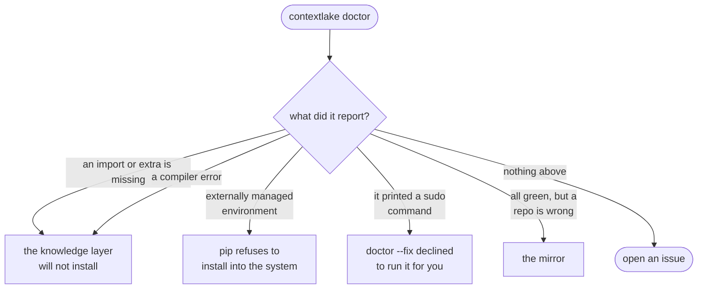

# Troubleshooting

Problems that have actually been hit while installing or running contextlake, each with the
fix and the reason behind it. If you hit something that is not here, please
[open an issue](https://github.com/sayak-sarkar/contextlake/issues): a reproducible failure
is worth more to this page than a guess.

Working on contextlake itself rather than using it? The contributor-side problems
(a distro-owned PyJWT, `pre-commit` diffs, slow local test runs) live in
[CONTRIBUTING.md](../CONTRIBUTING.md).

**Start here.** `contextlake doctor` checks the whole environment in one pass and names what
is wrong, so it is almost always faster than reading down this page:



<div class="dg-key">
  <i><b class="dg-sh-act"></b>a rounded box is something you run or do</i>
  <i><b class="dg-sh-step"></b>a rectangle is a section on this page</i>
  <i><b class="dg-sh-dec"></b>a diamond is a decision</i>
</div>

## The knowledge layer will not install

`[kb]` needs Python 3.10 or newer, because the `mcp` SDK does. The mirror side of contextlake
needs 3.10 or newer as well, so pip refuses the install outright rather than
leaving you a half-working one. Check with
`python3 --version`.

The extra also pulls a tree-sitter grammar per supported language, several with native
wheels. On a platform without prebuilt wheels those build from source, which is slow rather
than broken. **This is the only place a compiler error can come from**, so if a build starts and
fails, it is a grammar, not contextlake itself and not the built-in wiki LLM (`[llm-local]` is an
ordinary wheel, see the next section). Either install your platform's build tools and let it
finish, or pin the install to wheels only:

```bash
pip install -U --only-binary :all: "contextlake[kb-full]"
```

## The built-in wiki LLM is not installed

```
The built-in LLM needs the 'llm-local' extra (openvino-genai).
```

Install it into the interpreter contextlake is running in:

```bash
contextlake doctor --fix llm-local          # --dry-run prints the command and stops
```

It is an ordinary wheel, so there is no compiler, index URL or `--only-binary` pin involved.
The standalone binary installs it on first run and the full Docker image ships it baked in,
so neither channel hits this. See [Install and
upgrade](install.md#the-built-in-wiki-llm-is-one-extra) and [Installing the built-in
LLM](model-providers.md#installing-the-built-in-llm).

Releases before 7.0.0 ran a GGUF through `llama-cpp-python` and did need a wheel index plus a
C++ toolchain. If you are following older notes that tell you to pass `--extra-index-url` or
`--only-binary llama-cpp-python`, drop both: they now refer to a package contextlake no longer
depends on.

If you would rather not run a local model at all, use Ollama for the wiki tier
(`--llm ollama`).

## A Docker run fails with a permission error on the mount

The image runs as uid 1000, and a bind mount keeps the host's ownership, so if your host account is
not uid 1000 the container cannot write the store. Pass your own ids:

```bash
docker run -u "$(id -u):$(id -g)" -v "$PWD:/work" ghcr.io/sayak-sarkar/contextlake kb index
```

It fails rather than falling back on purpose. Before 5.1.0 the store went inside the container
instead, so the run looked like it succeeded and the index vanished when the container exited.

## There is no standalone binary for my platform

Three assets are published per release: Linux x86-64, macOS Apple silicon, and Windows x86-64.
macOS on Intel and Linux on arm64 are not among them, and no fourth asset is hiding under a
different name. Install with `pipx`, `pip` or `uv` on those platforms, or use the Docker image.
See [The standalone binary](install.md#the-standalone-binary).

## `contextlake doctor --fix` says the environment is externally managed

```
error: externally-managed-environment
```

Your distribution marked the system Python as managed by its own package manager (PEP 668),
and pip refuses to write into it. `--fix` reports this rather than retrying, because the fix
is where contextlake lives, not which flag you pass:

```bash
python3 -m venv .venv && . .venv/bin/activate
pip install "contextlake[kb-full]"
```

or let `pipx` own the environment: `pipx install "contextlake[kb-full]"`. Never reach for
`--break-system-packages`; it does what it says.

## `doctor --fix` printed a `sudo` command instead of running it

Working as designed. `--fix` installs **Python** packages into the current interpreter
unattended, but a **system** package needs administrator rights, so it is only ever offered
with a y/N prompt at a real terminal. `git` is the only such package `--fix` offers. Without
a TTY, or with `--skip-interactive`, the exact command is printed and nothing privileged
runs. That keeps a CI job or a scripted run from ever tripping a sudo prompt. Copy the
printed command, run it yourself, and re-run `contextlake doctor`.

## The mirror

Symptoms specific to mirroring a fleet, and what to do about each.

| Symptom | What to do |
| --- | --- |
| **"No projects loaded, run 'fetch' first"** | Run `contextlake mirror fetch` to populate the projects cache. If instead you see "The cached project list covers only `--repos` …", the cache exists but was built at a narrower scope; the same `fetch` fixes it. A command allowed to fetch for itself prints "Cache not found or invalid, fetching fresh data…" and does it, so there is nothing to do on that path. |
| **"Permission denied" during cloning** | Make sure `glab` is authenticated (`glab auth login`) and you can reach the repositories. |
| **"Timeout" errors** | Raise the relevant `*_timeout` settings, check connectivity, or lower `max_workers` (set it to `1` to run serially). Behind a TLS-inspecting proxy, set `GITLAB_TOKEN` so enumeration uses the built-in HTTP client. |
| **"Detached HEAD" states** | Handled automatically, the repo is skipped for pulls rather than failing. |
| **Nested `.git` directories** | A repo cloned into a subfolder of itself. `contextlake mirror verify` flags it; fix by moving the inner tree up one level and removing the empty folder. |
| **Cron job not running** | Check `crontab -l`, use absolute paths, and test the exact command in a shell first; inspect cron logs (`grep CRON /var/log/syslog`). See [Keep it fresh on a schedule](keep-fresh.md#keep-it-fresh-on-a-schedule). |
| **Large log files** | `--log-file` rotates itself; a shell redirect does not. See [Log files and rotation](keep-fresh.md#log-files-and-rotation). |

## Still stuck

Run `contextlake doctor` and include its full output in your issue. It reports the resolved
config paths, what is on your PATH, the store's real counts, and which optional pieces are
missing, which is most of what anyone would ask you for anyway.

## See also

- [Install and upgrade](install.md), every channel, and how to upgrade safely
- [Reading the console output](console-output.md), decoding a run
- [Command reference](cli-reference.md), the exact flags
- [CONTRIBUTING.md](../CONTRIBUTING.md), problems you hit working on contextlake itself
