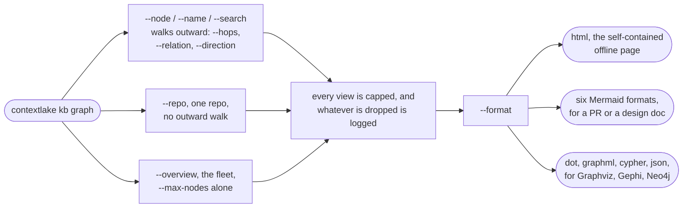

# Visualize the graph

`contextlake kb graph` draws a **bounded** slice of the graph. The whole thing (hundreds of thousands of
nodes) is far too large to render, so every view is scoped from a seed and capped:

```bash
contextlake kb graph --overview --open                 # repos-as-nodes: the architecture map
contextlake kb graph --name CatalogService --kind class  # a symbol's neighbourhood (default 2 hops)
contextlake kb graph --node <id> --hops 3              # expand around an exact node id
contextlake kb graph --search "payment" --open         # seed from a full-text search
contextlake kb graph --repo acme/catalog-api           # one repo's internal code graph
```



<div class="dg-key">
  <i><b class="dg-sh-act"></b>a rounded box is a start or an end point</i>
  <i><b class="dg-sh-step"></b>a rectangle is something that runs</i>
</div>

Which seed you pick decides which flags apply at all: only a seeded view walks outward, so `--hops`,
`--relation` and `--direction` have nothing to do on `--repo` or `--overview`. `sequencediagram`
applies that rule in the other direction: it needs exactly one seed, so it is the one format `--repo`
and `--overview` cannot produce.

`contextlake kb graph --repo <repo>` renders one repo's internal code graph to a single self-contained HTML
page: nodes coloured by kind and sized by degree, edges by relation, with an in-page layout switcher,
search, and a minimap; it opens straight from `file://`:

<p align="center">
  
</p>

Seed with one of `--node` / `--name` (+`--kind`) / `--search` / `--repo` / `--overview`. `--limit` (default
`20`) caps how many seed nodes a `--name` or `--search` match contributes, before the walk starts, and
the run logs how many matched when it trims. It is the knob for "this name matches 300 symbols and I
only want a view of the first few". Bound the result
with `--max-nodes` (500, or 5000 on `--overview`, which is a fleet inventory and defaults to loading
every repo so any of them is findable; it is a bound on the **whole file**: one-hop external
nodes are counted against it too, and links take a bounded share of whatever the repo's own nodes
leave unused), `--max-edges` (**`--repo` views only**, see the mode list below; no cap by default,
which is what the `html` and `dot` renderers want,
and 400 for the Mermaid-rendered formats `mermaid` / `classdiagram` / `statediagram` / `erdiagram` /
`deploymentdiagram` -- a dense repo can
pack well over 500 edges into 500 nodes, which used to exceed Mermaid's own render limit and fail outright;
capping edges there means a `--repo` view always renders, possibly truncated, never errors. A **seeded**
Mermaid view gets no edge cap, so it can still exceed that limit and fail; narrow it with `--hops` or
`--max-nodes` instead), and `--max-fanout` (a per-node cap that
stops hub nodes from exploding: 50 on a seeded view, uncapped on a `--repo` view unless you
pass it, since capping containment fan-out by default would hide a file's own symbols), whatever
is dropped is **logged**, never silently truncated.

`--hops` (default 2), `--relation` and `--direction {in,out,both}` shape the **walk**, so they apply
to the seeded modes (`--node` / `--name` / `--search`) only. `--overview` and `--repo` do not walk
outward from a seed, so passing those three with either of them has no effect. What each mode does
take: a seeded view, all of them except `--max-edges`, which the seeded path never receives, so it is
accepted and then ignored; `--repo`, `--max-nodes` / `--max-edges` / `--max-fanout`;
`--overview`, `--max-nodes` alone.

For a `--repo` view over `--max-nodes`, which nodes
survive the cut is ranked by degree (highest-connected nodes kept first, ties broken by node id)
rather than an arbitrary node-id order, so a truncated diagram keeps the most connected part of the repo
instead of whatever happened to sort first. Degree alone is not the whole rule: every kind present in
the view is guaranteed a small floor of slots first, because pure degree ranking starved the rare kinds
completely (on one measured repo it kept 0 of 412 `table` and 0 of 402 `resource` nodes), which made
`erdiagram` and `deploymentdiagram` render empty for a repo that plainly had the data. On the
dashboard, a repo too large to show in one diagram is auto-narrowed to its largest module, recursively
and to any depth, with a clickable breadcrumb back out and a "Narrow further..." picker, instead of an
arbitrary slice (see [The dashboard](dashboard.md)).

## Output formats

Output is chosen with `--format`:

- **`html`** (default), a single **self-contained, offline** page (cytoscape.js is inlined, so it opens
  from `file://` with no network, handy air-gapped / behind a proxy). Nodes are coloured by kind and sized
  by degree; edges are styled by relation/confidence with their labels hidden until you click a node (so
  the view stays readable). Pan, zoom, drag, and a **layout switcher** (`cose`, `concentric`,
  `breadthfirst`, `circle`, `grid`, `dagre`) in the page, set the initial one with `--layout`. `dagre` is
  a preview: it is layered and directed rather than organic, and below 400 nodes it renders each node as
  an HTML card instead of a dot. `--open` launches the
  browser; `--cdn` produces a small online-only file instead, and applies to `--site` as well as
  the single-file export.
- **`dot`**, Graphviz (`contextlake kb graph ... --format dot | dot -Tsvg > g.svg`).
- **`mermaid`**, the relation graph, pastes into Markdown / GitHub.
- **`classdiagram`**, a **Mermaid UML class diagram** for a repo (or a seeded slice): classes / interfaces
  / structs with their methods as members, and `inherits` edges as inheritance arrows (`<|--` extends,
  `<|..` implements). Great for a PR or design doc: `contextlake kb graph --repo acme/app --format classdiagram`.
- **`sequencediagram`**, a **Mermaid call-order trace** from one seeded function, each caller's callees
  ordered by call-site line, the order they actually appear in the source: `contextlake kb graph --name
  process_order --format sequencediagram`. Needs exactly one seed (`--node`/`--name`/`--search`, not
  `--repo`/`--overview`; there's no single obvious ordering across unrelated seeds), and depth follows
  the view's own `--hops`. Recursion/cycles stop cleanly (a function already on the current call path
  isn't re-entered) instead of hanging.
- **`statediagram`**, a **Mermaid entity state machine**: guarded assignments to a status/state/stage field
  (`if order.status == Created: order.status = Paid`) become transitions, labeled with the method that
  makes them. Only *guarded* transitions are emitted: the source state must be established by a preceding
  comparison on the same field, so a diagram never claims a transition the code doesn't actually establish
  (an honest undercount, not a guess). Best with `--repo`, like `classdiagram`: `contextlake kb graph --repo
  acme/app --format statediagram`. A `--name`/`--node` seed can reach the state nodes (via the file that
  declares them) but not their transitions past the view's `--hops`; use `--repo` for the full picture.
  Multiple entities in view each get their own composite block; a single-entity view renders flat.
- **`erdiagram`**, a **Mermaid ER diagram** of `table`/`view` definitions and their foreign-key
  `references` edges, from the SQL DDL extractor (see [Index & Code Graph](index-code-graph.md)):
  `contextlake kb graph --repo acme/app --format erdiagram`. No attribute/column data (the extractor
  only captures `CREATE TABLE`/`VIEW` names and FK targets), so entities render as bare boxes with
  relationship lines, not column lists. A `REFERENCES` clause always points child-row to parent-row,
  so the parent is drawn on the "one" side of the notation. **Only sees raw `.sql` DDL**, an
  ORM-defined schema (SQLAlchemy, Entity Framework, TypeORM model classes, no literal `CREATE TABLE`
  text anywhere) renders an empty diagram with guidance, not a bug.
- **`deploymentdiagram`**, a **Mermaid flowchart** of Terraform/HCL `resource`/`data`/`module`
  definitions grouped by an inferred category
  (network/compute/storage/database/security/other/module; a resource type matching none of the
  keyword lists lands in `other` and gets its own subgraph),
  from the HCL extractor (see [Index & Code Graph](index-code-graph.md)): `contextlake kb graph --repo
  acme/infra --format deploymentdiagram`. Category is a keyword heuristic over the resource type prefix (e.g.
  `aws_security_group.web` -> security); `depends_on` edges reconstructed from `var.`/`module.`/
  type-name interpolation references draw the connections between resources. A single-category view
  renders flat (no subgraph wrapper). **Terraform-only** (HCL is the only IaC language the extractor
  parses): a repo with no `.tf` files renders an empty diagram with guidance, not a bug.
- **`graphml`**, the standard [GraphML](http://graphml.graphdrawing.org/) interchange format for
  [Gephi](https://gephi.org/)/[yEd](https://www.yworks.com/products/yed): `contextlake kb graph --repo
  acme/app --format graphml --output g.graphml`. Nodes/edges carry real attributes (kind, name, repo,
  file, line, lang / relation, confidence, weight) as GraphML `<data>` keys, so Gephi's own filter and
  color-by-attribute tools work directly against them, not just a bare shape.
- **`cypher`**, `CREATE` statements for a [Neo4j](https://neo4j.com/)/[FalkorDB](https://www.falkordb.com/)
  import: `contextlake kb graph --repo acme/app --format cypher --output g.cypher`, then `cypher-shell -f
  g.cypher` (or FalkorDB's own loader). Node labels come from `kind`, relationship types from `relation`,
  both backtick-quoted (contextlake's kind/relation vocabularies are open text, not a fixed enum, so
  quoting handles arbitrary values without a lossy sanitization pass into PascalCase/UPPER_SNAKE).
- **`json`**, the raw `{nodes, edges, meta}` for cytoscape / custom tooling (Gephi/yEd users want
  `--format graphml` instead, real typed attributes, not a bespoke shape to parse).

For interactive exploration of a large graph, `contextlake kb graph --serve` runs a local web UI where
clicking a node **expands** it (fetches its neighbours on demand) so you can walk the graph without
pre-rendering all of it. With `--overview` it serves something larger: the whole cross-linked site,
overview plus a page per repo, each repo page rendered on demand rather than pre-built, which is the
live counterpart of `--site`. It binds `--host` (default `127.0.0.1`) and `--port` (default `8765`), so
with no flags it is at `http://127.0.0.1:8765`. Like the dashboard, it answers a request only when the
`Host` header names the
address it was bound to (`--host`) or `localhost`, port included, that pinning is what stops a page on
an attacker domain that re-resolves to `127.0.0.1` from reading your graph cross-origin. Bind the address
you intend to browse rather than a wildcard (see [dashboard.md](dashboard.md#11-mutating-routes)).

## Working the served graph

The page `--serve` gives you is a surface you drive, not a picture you look at. Four controls
carry most of the work.

### Expand a node, as far as you want

Click a node and contextlake fetches its neighbours from the store and adds them to the canvas.
Two controls in the sidebar decide what that fetch asks for:

- **depth**: how many hops out to walk, 1 to 3. The server caps it at 3, so a slider at its
  maximum and the server's ceiling are the same number.
- **edges**: `both`, `outgoing`, or `incoming`. This chooses which edges the walk is allowed to
  follow, so it changes which nodes come back, not how they're drawn.

Both apply to the **next** node you expand. Expanding is additive, so nothing you've
already opened is removed when you change them.

Set `edges` to `outgoing` and you're asking "what does this depend on"; set it to `incoming` and
you're asking "what depends on this".

### Trace what a node reaches

Selecting a node highlights the things next to it. To follow the chain instead, use
**Trace downstream** in the inspector. It walks edge direction as far as it goes and reports how
many nodes it found ("4 nodes downstream"). It appears only on nodes that have an outgoing edge.

It traces the graph currently on the canvas. In `--serve` mode that's whatever you've expanded so
far, so if a trace looks short, expand further with **depth** raised, then run it again.

### Filter with the legend

The **Nodes** legend groups every kind present into the vocabulary's ten bands: Symbols,
Containers, Service surfaces, Data model, Infrastructure, Presentation, Configuration, Documents,
Cross-source, Boundary. A band appears only when something in it is on the canvas.

Click any kind to hide it, and any relationship in the **Relationships** legend to hide those
edges. **Reset view & filters** in the toolbar brings everything back.

### What's folded away, and where it went

On `--site` pages, structural leaves are folded into their container rather than drawn. A node
folds when nothing points out of it and the only thing pointing at it is `contains`: a config
key, a macro, a struct field. On a large repository these are most of the graph, and drawing
them adds a dot and a label that answer nothing the container doesn't already answer.

Nothing disappears quietly. The status bar says how many went
(`412 leaves folded into their containers`), and selecting a container shows the tally for that
node, as `folded  19 (config_key 14, macro 5)`. The full graph is still in the store; use
`contextlake kb graph --kind config_key` or the MCP tools to reach it.

## Composed namespace C4 diagram

`contextlake kb graph --c4` renders a different kind of view: a composed **C4-Context/Container** diagram over
the whole fleet, namespaces are the boundaries, repos are the containers inside them, and the aggregated
`depends_on`, HTTP `flow`, and event `flow` edges become the labeled inter-service connections (grouped by
flavor and weight, e.g. `http x3`). It renders graph data that `index`/`connect` already extracted, so it
runs fully offline and adds no new extraction pass. `--group-depth N` (default `1`) controls how deep into
the namespace path the boundaries are drawn, and `--repos <glob>` scopes the diagram to matching repos.
Because it only draws coupling the graph already resolved (weight-ranked), it doesn't invent links, and
folding event-flow in alongside HTTP keeps it from telling an HTTP-only half story:

```bash
contextlake kb graph --c4 --group-depth 2 --open       # HTML, open in the browser
contextlake kb graph --c4 --format dot > c4.dot        # clustered DOT, copy-pasteable
```

Output is chosen with `--format`: `html` (default, an interactive page with namespace boundaries as
compound nodes, written to `<store>/graphs/c4.html`), `dot` (Graphviz clustered DOT with `subgraph
cluster_*` boundaries), or `json` (the raw payload). `--format mermaid`, `classdiagram`, `sequencediagram`,
`statediagram`, `erdiagram`, and `deploymentdiagram` aren't supported with `--c4` (the command exits
with an error), and `--serve` doesn't apply either, the C4 view is a generated file, not a live server.
`--format graphml` and `--format cypher` are neither rejected nor honoured: `--c4` falls through to the
HTML renderer and, because the output path is only defaulted for `--format html`, prints that HTML to
stdout. Pass `--output <path>` if you hit it, and use `dot` or `json` for a real C4 export.

### C1: external systems

`--c4 --c1` adds a layer on top of the same view: one dashed box per distinct host an indexed repo
calls over HTTP that never resolves to any indexed repo's exposed route, connected by a
`calls_external x<weight>` edge, drawn outside every namespace boundary:

```bash
contextlake kb graph --c4 --c1 --group-depth 2 --open
```

**Deliberately unclassified.** contextlake can't tell a genuine third-party dependency (Stripe,
GitHub's API) apart from an internal service this fleet simply hasn't indexed yet, both look
identical here: an HTTP call whose target path matches no indexed repo's `exposes` route. Read the
box labels yourself; you'll recognize your own internal hosts. `--c1` requires `--c4` (it has no
meaning on its own) and needs no new extraction pass, the host was already captured at index time,
just never used until this view asks for it.

## See also

- [The dashboard](dashboard.md)
- [Index the code graph](index-code-graph.md)
- [Serve it to your editor](serve.md)
